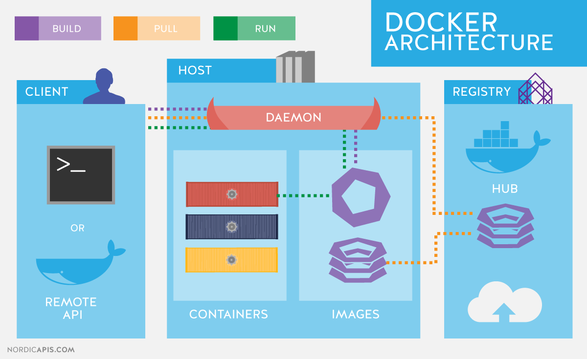
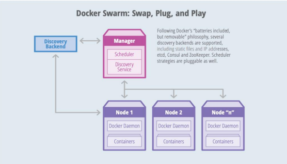
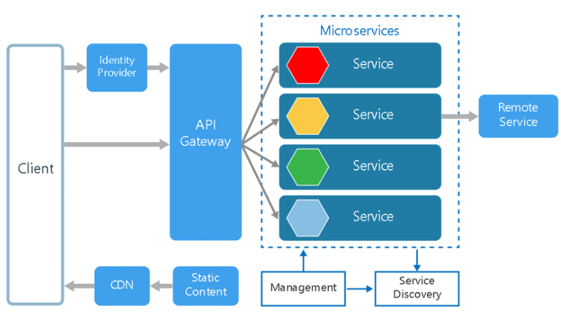
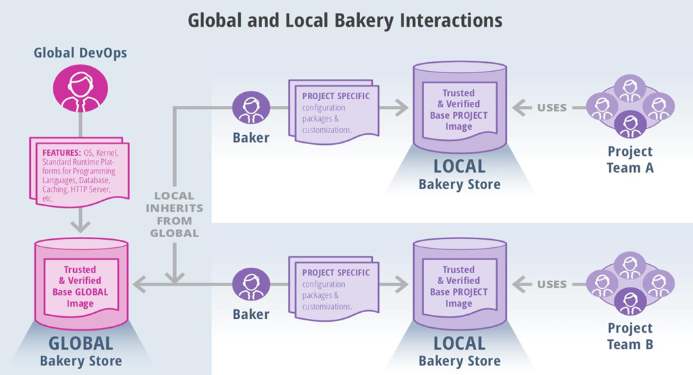
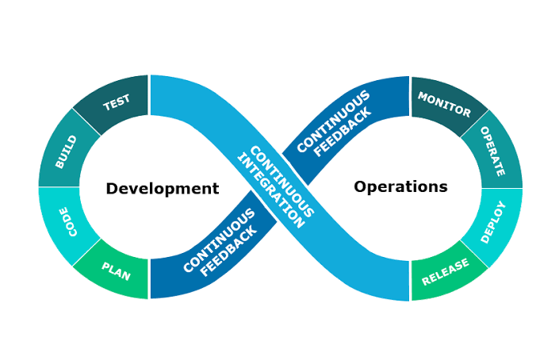

### **Q1. How can the `.dockerignore` file enhance Docker image efficiency and security? Mention two file types it should exclude.**

**Answer:**

* The `.dockerignore` file prevents unnecessary files from being sent to the Docker daemon during image builds, reducing the build context size.
* This improves build speed, minimizes the final image size, and helps prevent sensitive files from being accidentally included.
* Two common entries:

  * `node_modules/` – large, platform-dependent, and often rebuilt inside the container.
  * `.git/` – version history not needed in images and could expose commit data or secrets.

---

### **Q2. Why is it important to exclude `node_modules` and `.git` directories when building Docker images?**

**Answer:**

* `node_modules/` may contain hundreds of MBs and is OS-specific; installing it inside the container ensures compatibility.
* `.git/` contains sensitive commit history and bloats the image.
* Including them increases the risk of exposing secrets and slows down image builds.

---

### **Q3. Explain the role of `.dockerignore` in securing and optimizing Docker image builds.**

**Answer:**

* Acts similarly to `.gitignore` but for Docker.
* Filters out unneeded files from the build context.
* Reduces image size, build time, and risk of leaking local development files or credentials.

---

### **Q4. What risks are associated with including large or sensitive files in Docker image builds?**

**Answer:**

* Large files (e.g., logs, cache) increase the image size and prolong transfer times.
* Sensitive files like `.env` or `private.key` could be exposed if pushed to a public registry.
* Always include these files in `.dockerignore` to avoid security and performance issues.

---

### **Q5. Why should logs and build artifacts be excluded from Docker images? Provide examples.**

**Answer:**

* Log files (`*.log`) and compiled files (`dist/`, `build/`) are environment-specific and unnecessary in production containers.
* Including them inflates the image and can lead to accidental data exposure.
* Use:

  ```plaintext
  *.log
  dist/
  ```

---

### **Q6. Differentiate IaaS and SaaS in terms of user control and service scope.**

**Answer:**

* **IaaS (Infrastructure as a Service)** provides virtualized resources like servers, storage, and networking. Users manage OS and software.

  * Example: AWS EC2.
* **SaaS (Software as a Service)** delivers ready-to-use applications over the internet.

  * Example: Google Docs.
* IaaS gives more control; SaaS gives more convenience.

---

### **Q7. What are the core features of Platform as a Service (PaaS)? Name one example.**

**Answer:**

* PaaS abstracts the infrastructure and runtime environment, letting developers focus only on code.
* Key features:

  * Automated scaling.
  * Built-in CI/CD and database support.
* Example: **Heroku** allows quick deployment of applications with minimal config.

---

### **Q8. Where does IaaS fit in the cloud computing stack and what control does it offer?**

**Answer:**

* IaaS is the base layer offering virtualized hardware.
* It gives users control over:

  * OS installation.
  * Software stack.
  * Security and network configurations.
* Ideal for admins needing full environment customization.

---

### **Q9. Compare responsibilities between PaaS and SaaS models.**

**Answer:**

* **PaaS**:

  * User writes and deploys code.
  * Provider manages runtime, scaling, infra.
* **SaaS**:

  * Provider manages everything from infra to UI.
  * User only consumes the app (e.g., Gmail).
* PaaS offers flexibility for developers; SaaS offers usability for end users.

---

### **Q10. Provide an example of IaaS and explain the resources it offers.**

**Answer:**

* **Example:** AWS EC2.
* Offers:

  * Compute instances.
  * Network configuration (VPCs).
  * Storage (EBS volumes).
* Users configure security groups, OS, and install their applications.

---

### **Q11. Write a Docker Compose snippet for a frontend-backend setup with a custom network.**

**Answer:**

```yaml
version: '3.8'
services:
  my-backend:
    image: my-backend
    networks:
      - app-net

  my-frontend:
    image: my-frontend
    networks:
      - app-net

networks:
  app-net:
    driver: bridge
```

* Both services share `app-net` and communicate using service names.
* Docker’s embedded DNS handles name resolution.

---

### **Q12. How does Docker Compose enable service-to-service communication?**

**Answer:**

* Services in the same Docker Compose file and network can reach each other by **service name**.
* Docker provides an internal DNS, allowing names like `my-backend` to resolve automatically.
* No need for manual IP addresses.

---

### **Q13. Why is a user-defined network preferred in Docker Compose?**

**Answer:**

* Provides better isolation and name resolution.
* Avoids using the default `bridge` network which is shared.
* Enables cross-container DNS resolution and custom subnet configuration.

---

### **Q14. Explain how DNS-based container discovery works in Docker Compose.**

**Answer:**

* Docker Compose uses a built-in DNS system.
* When containers share a custom network, they can resolve each other using their service name.
* Example: `my-frontend` can ping `my-backend` if both are on the same network.

---

### **Q15. How would you define a named custom network in Docker Compose and why?**

**Answer:**

* Define in the `networks` section:

  ```yaml
  networks:
    my-network:
      driver: bridge
  ```
* Assign it to each service.
* Enables control over networking, isolation, and better integration in multi-project environments.

---

### **Q16. A service fails to start. Which Compose command helps view real-time logs and how?**

**Answer:**

* Use: `docker-compose logs -f`
* Shows streaming logs from the container.
* Helps detect runtime errors, missing services, or config issues.

---

### **Q17. Which command checks `docker-compose.yml` syntax before deployment?**

**Answer:**

* Command: `docker-compose config`
* Validates syntax and merges config files.
* Catches typos, indentation issues, and invalid keys before deployment.

---

### **Q18. How does `docker-compose ps` help in identifying container status?**

**Answer:**

* Shows container status: running, exited, or restarting.
* Indicates if services failed during startup or exited with a specific code.
* Example output:

  ```
  Name          Command       State     Ports
  my-backend    run.sh        Exited    0
  ```

---

### **Q19. How do you use service-specific logs to debug container startup issues?**

**Answer:**

* Use: `docker-compose logs my-backend`
* Reveals detailed error logs like port binding failure, missing environment variables, or dependency failures.

---

### **Q20. Name two Docker Compose commands useful in diagnosing service failures.**

**Answer:**

* `docker-compose logs <service>` – Fetches logs to see runtime issues.
* `docker-compose config` – Validates and shows the merged configuration.
* Together, they help identify both build-time and run-time problems.

---

Certainly! Below are the **rephrased versions of the five questions** along with **detailed answers** for each, suitable for a 5-mark evaluation format.

---

### **Q21 :**

In a multi-container Docker environment, how can you streamline and secure the image build process by excluding irrelevant files? Mention two types of files or directories that should be excluded and indicate which Docker configuration file is used for this purpose.

**Answer:**
To optimize and secure Docker image builds in a multi-service setup, it’s essential to exclude files that are unnecessary for the container runtime. This is done using the `.dockerignore` file, which tells Docker to skip sending certain files and folders during the build process.

Two common exclusions are:

* `node_modules/`: This directory contains platform-specific dependencies that are often re-installed during container setup. Including it bloats the image and can cause compatibility issues.
* `.git/`: This contains version history and metadata that are irrelevant to the container. Including it can increase image size and risk exposing sensitive commit data.

By using `.dockerignore`, you reduce build time, improve security, and create smaller, more efficient images.

---

### **Q22 :**

Select and compare any two cloud computing service models from IaaS, PaaS, and SaaS. Explain their full forms, main features, and provide one example platform for each.

**Answer:**
Two cloud service models are:

* **IaaS (Infrastructure as a Service)**: Offers virtualized computing resources like servers, storage, and networking. Users manage the OS, middleware, and applications.

  * **Core Offerings**: Compute instances, virtual machines, storage, and network configurations.
  * **Example**: Amazon EC2 – provides scalable virtual servers on demand.

* **PaaS (Platform as a Service)**: Provides a managed environment for developers to deploy, run, and scale applications without dealing with infrastructure or runtime setup.

  * **Core Offerings**: Runtime environments, application hosting, databases, and scaling.
  * **Example**: Heroku – allows developers to deploy web applications with just code and a few configuration settings.

These models differ in terms of user responsibility—PaaS abstracts more of the system than IaaS.

---

### **Q23 :**

You need to deploy a frontend and backend application using Docker Compose with communication between them over a custom network. Write a suitable configuration using `my-frontend` and `my-backend` as image names, and explain how service discovery works in this setup.

**Answer:**
Here is a sample `docker-compose.yml` configuration:

```yaml
version: '3.8'

services:
  my-frontend:
    image: my-frontend
    networks:
      - app-network

  my-backend:
    image: my-backend
    networks:
      - app-network

networks:
  app-network:
    driver: bridge
```

**Explanation:**

* Both services are connected to a user-defined network called `app-network`.
* Docker Compose provides internal DNS resolution; services can communicate using their service names as hostnames.
* For example, `my-frontend` can reach `my-backend` simply by using `http://my-backend` in its code.

This setup ensures isolated networking and seamless inter-service communication.

---

### **Q24 :**

When using Docker Compose to start multiple services, one of them fails to launch. Which two Docker Compose commands can you use to troubleshoot this issue, and what does each command reveal?

**Answer:**
Two useful Docker Compose commands for diagnosing service startup issues are:

1. **`docker-compose logs <service-name>`**

   * Displays the log output from the specified service.
   * Helps identify runtime errors such as missing dependencies, configuration issues, or connection failures.

2. **`docker-compose config`**

   * Validates and displays the merged Compose file configuration.
   * Useful for spotting misconfigurations, syntax errors, or incorrect property values in the YAML file.

Together, these commands provide visibility into both configuration-level and runtime-level problems, allowing faster troubleshooting.

---

### **Q25 :**

After deploying a containerized application, it exits immediately after starting. Which two Docker CLI commands would you use to investigate the issue and understand why the container is terminating?

**Answer:**
To diagnose containers that exit prematurely, the following Docker commands are essential:

1. **`docker logs <container-id>`**

   * Shows the standard output and error logs from the container.
   * Useful to inspect crash messages, unhandled exceptions, or missing configuration.

2. **`docker inspect <container-id>`**

   * Provides detailed metadata about the container, including exit code, environment variables, and volumes.
   * Helps confirm whether the container ran the correct command or failed due to a misconfiguration.

These commands provide both high-level and in-depth insights into why a container exits unexpectedly, facilitating effective debugging.

---

## Q26: What is Docker (up to 2 marks)? Explain its architecture with a Diagram (4 marks)? What are the key components of Docker architecture (up to 4 marks)?

---

### **What is Docker? (2 Marks)**

Docker is an open-source platform used to automate the deployment, scaling, and management of applications inside lightweight, portable containers. These containers package all the dependencies (code, libraries, environment variables, configuration files) needed to run the application, ensuring consistency across development, testing, and production environments.

**Key advantages:**

* Portability: Runs consistently across different environments.
* Efficiency: Containers are lightweight and use system resources more efficiently than virtual machines.
* Speed: Faster start-up and deployment times compared to traditional VMs.

---

### **Docker Architecture (4 Marks)**

Docker follows a **client-server architecture**. The client communicates with the Docker daemon (server), which performs actions like building, running, and distributing containers. The architecture supports modularity, with components like registries and volumes.

#### **Diagram:**



---

### **Explanation of the Architecture:**

1. **Docker Client**:

   * Provides a command-line interface (`docker` CLI) used by users to interact with the Docker daemon.
   * Sends commands like `docker build`, `docker run`, `docker pull` to the Docker daemon using REST APIs.

2. **Docker Daemon (`dockerd`)**:

   * Listens for Docker API requests.
   * Manages Docker objects (images, containers, volumes, networks).
   * Can communicate with other daemons to manage services in a Docker Swarm.

3. **Docker Images**:

   * Read-only templates used to create containers.
   * Can be built from a Dockerfile.
   * Pulled from Docker Hub or custom registries.

4. **Docker Containers**:

   * Runnable instances of Docker images.
   * Lightweight and isolated from the host system but share the OS kernel.
   * Have their own filesystem, networking, and process space.

5. **Docker Registries**:

   * Storage and distribution system for Docker images.
   * Default public registry is **Docker Hub**.
   * Private registries can be set up for enterprise use.

6. **Docker Objects**:

   * Includes containers, images, volumes, networks, and services.
   * Managed via the Docker CLI or API.

---

### **Key Components of Docker Architecture (4 Marks)**

| Component              | Description                                                                |
| ---------------------- | -------------------------------------------------------------------------- |
| **Docker Client**      | Acts as the user interface to Docker. Sends commands to the Docker daemon. |
| **Docker Daemon**      | Performs container operations. Listens to Docker API requests.             |
| **Docker Images**      | Blueprints for containers. Stored in registries.                           |
| **Docker Containers**  | Running instances of images. Lightweight and isolated.                     |
| **Docker Registries**  | Hosts Docker images. Docker Hub is the default.                            |
| **Volumes & Networks** | Support persistent storage and communication between containers.           |

---


## Q27: Explain the Docker Swarm architecture with a diagram (up to 5 marks). Explain the key components (up to 5 marks).

### Docker Swarm Architecture (5 Marks)

Docker Swarm is Docker’s native orchestration and clustering tool that turns a pool of Docker hosts into a single, virtual Docker engine. This enables easier scaling, load balancing, and service discovery.

Swarm follows a **manager-worker architecture** where tasks are distributed to nodes based on availability and resource needs. Communication between nodes is encrypted and secure.

#### **Diagram:**



This diagram illustrates a typical Docker Swarm setup with one **Manager Node** and multiple **Worker Nodes**, all connected via an overlay network.

---

### Key Components of Docker Swarm (5 Marks)

1. **Manager Node**

   * Responsible for managing the Swarm.
   * Handles orchestration tasks like scheduling services, maintaining cluster state, and service scaling.
   * Uses Raft consensus for fault tolerance.
   * Can also run containers (optional).

2. **Worker Node**

   * Executes tasks assigned by the manager.
   * Does not participate in the orchestration decisions.
   * Can be added/removed from the swarm dynamically.

3. **Services**

   * High-level definitions of containers to be deployed across the swarm.
   * Consist of multiple **tasks** which are distributed across worker nodes.
   * Can be **replicated services** (multiple instances) or **global services** (one per node).

4. **Tasks**

   * The atomic unit in Swarm; represents a container and its execution command.
   * Tasks are assigned to worker nodes.

5. **Overlay Network**

   * Allows communication between services running on different nodes.
   * Each service can connect to one or more overlay networks for secure internal communication.

6. **Ingress Load Balancer**

   * Automatically distributes incoming traffic to available service replicas.
   * Supports internal DNS resolution so services can refer to each other by name.

7. **Docker CLI/REST API**

   * Interface for users to interact with the Swarm.
   * Used for creating services, scaling applications, or inspecting the Swarm state.

---

### Summary:

Docker Swarm provides a lightweight and native way to manage containers at scale. It supports service discovery, fault tolerance, secure communication, and load balancing—all using a declarative model that developers can manage using the standard Docker CLI.


## Q28: Compare Docker Swarm, Kubernetes, and Apache Mesos. (10 Marks)

| Feature / Criteria                | Docker Swarm                           | Kubernetes                                    | Apache Mesos                                      |
| --------------------------------- | -------------------------------------- | --------------------------------------------- | ------------------------------------------------- |
| **1. Developed By**               | Docker Inc.                            | Originally by Google, now CNCF                | Apache Software Foundation                        |
| **2. Release Year**               | 2015                                   | 2014                                          | 2009                                              |
| **3. Architecture Type**          | Simple manager-worker                  | Master-node with etcd                         | Two-level (Mesos master and frameworks)           |
| **4. Installation Complexity**    | Very easy, native to Docker            | More complex, requires configuration          | Most complex setup among the three                |
| **5. Learning Curve**             | Beginner-friendly                      | Moderate to steep                             | Steep (meant for large-scale distributed systems) |
| **6. Load Balancing**             | Built-in with routing mesh             | Manual service configuration (via Ingress)    | Requires Marathon or other frameworks             |
| **7. Auto-scaling**               | Not supported natively                 | Natively supported                            | Supported via Marathon                            |
| **8. Service Discovery**          | Built-in DNS-based                     | kube-dns / CoreDNS                            | Needs external tools                              |
| **9. High Availability (HA)**     | Supported via manager node replication | Strong HA with multiple master nodes          | Supported, complex configuration                  |
| **10. Storage Management**        | Basic volume support                   | Advanced, with persistent volumes and CSI     | External plugins required                         |
| **11. Health Checks**             | Basic health checks                    | Extensive support (liveness/readiness probes) | Supported via Mesos or frameworks                 |
| **12. Community & Ecosystem**     | Smaller, part of Docker ecosystem      | Very large, active, and growing               | Moderate but niche community                      |
| **13. GUI / Dashboard**           | No native dashboard                    | Kubernetes Dashboard                          | Available via Mesosphere DC/OS                    |
| **14. Container Runtime Support** | Docker only                            | Containerd, CRI-O, Docker (deprecated)        | Docker, rkt, custom runtimes                      |
| **15. Use Cases**                 | Best for small to medium projects      | Ideal for large-scale, production-grade apps  | Designed for big data and multi-framework ops     |

---

### Summary:

* **Docker Swarm**: Best suited for smaller deployments and simpler orchestration needs. Easy to use and integrate with Docker-based workflows.
* **Kubernetes**: Industry standard for container orchestration. Offers powerful features for scalability, resilience, and automation.
* **Apache Mesos**: A more general-purpose distributed systems kernel. Used for managing both containerized and non-containerized workloads, especially in data center environments.


### Q29 **Compare between virtualization vs Docker containerization (Up to 5 Marks)**

| Feature               | Virtualization (VMs)                                           | Docker Containerization                                  |
| --------------------- | -------------------------------------------------------------- | -------------------------------------------------------- |
| **Technology**        | Hypervisor-based virtualization                                | OS-level virtualization                                  |
| **Isolation**         | Full hardware-level isolation with separate OS instances       | Process-level isolation sharing host OS kernel           |
| **Performance**       | Higher overhead due to guest OS and hypervisor                 | Near-native performance with minimal overhead            |
| **Boot Time**         | Slow (in minutes)                                              | Fast (in seconds)                                        |
| **Resource Usage**    | Heavier – each VM has its own OS and kernel                    | Lightweight – containers share the host OS               |
| **Portability**       | Less portable due to OS dependencies                           | Highly portable across any environment with Docker       |
| **Size**              | Large image sizes (several GBs)                                | Small image sizes (few MBs to hundreds of MBs)           |
| **Security**          | Better isolation, more secure in hostile environments          | Shared kernel – increased risk without proper sandboxing |
| **Use Cases**         | Legacy apps, OS-level virtualization, infrastructure emulation | Microservices, CI/CD pipelines, scalable deployments     |
| **Example Platforms** | VMware, VirtualBox, KVM                                        | Docker, Podman                                           |

> ✅ **Conclusion:**
> Containers are best suited for **agile, microservices-based applications** and offer **faster deployment**, while VMs are more appropriate for **full-stack isolation** and **multi-OS support**.

---

### **Explain the idea of virtualization an application using Docker with a Dockerfile example (Up to 5 Marks)**

Docker enables **application-level virtualization** by packaging applications and their dependencies into isolated containers. This means that you don’t need to install the application’s runtime, libraries, or even the programming language on the host system — everything is defined in the **Dockerfile** and built into the image.

---

#### ✅ Example: Virtualizing a Python Flask Application using Docker

**1. Application:** A simple Flask web server
**2. Dockerfile:**

```Dockerfile
# Base image with Python
FROM python:3.9-slim

# Set working directory
WORKDIR /app

# Copy application code into container
COPY . /app

# Install required Python packages
RUN pip install -r requirements.txt

# Expose port on which app runs
EXPOSE 5000

# Define the startup command
CMD ["python", "app.py"]
```

**3. requirements.txt:**

```
flask
```

**4. app.py (Minimal Flask App):**

```python
from flask import Flask
app = Flask(__name__)

@app.route('/')
def hello():
    return "Hello from Dockerized Flask!"

if __name__ == '__main__':
    app.run(host='0.0.0.0', port=5000)
```

---

### 🧩 How It Works:

* The base image provides Python (virtual environment base).
* All code and dependencies are copied into the container.
* On build, Docker installs required packages (`pip install`).
* On run, the container starts the Flask app just like it would on your local machine.

### 📦 Result:

You now have a **self-contained, isolated runtime** environment for your Flask application. This container can be run anywhere — development, testing, or production — without any host-specific changes.

---


Here's a detailed answer suitable for a **10-mark question** on **YAML files**, with examples and clarity on structure and real-world relevance:

---

## Q30: **Explain what a YAML file and its key features (upto 2 marks). What are the valid entries that a YAML file can contain (upto 2 marks)? Give an example of a YAML file used in Docker Compose (upto 3 marks). List four other use cases of YAML other than Docker Compose (upto 3 marks).**

---

### ✅ What is a YAML File and its Key Features (Up to 2 Marks)

**YAML** stands for "**YAML Ain't Markup Language**". It is a human-readable data serialization standard often used for configuration files.

#### ✨ Key Features of YAML:

* **Readable**: Clean and easy to write (indented using spaces).
* **Lightweight**: Simpler than XML or JSON for configs.
* **Hierarchical**: Supports nested data structures (lists, dictionaries).
* **Language-independent**: Widely supported in many programming environments.

---

### ✅ Valid Entries a YAML File Can Contain (Up to 2 Marks)

A YAML file supports the following **data types and structures**:

| Entry Type           | Example                                       |
| -------------------- | --------------------------------------------- |
| **Scalars**          | `name: docker-app`                            |
| **Lists**            | `- frontend`<br>`- backend`                   |
| **Dictionaries**     | `image: nginx`<br>`ports: ["80:80"]`          |
| **Nested Maps**      | `services:`<br>  `web:`<br>    `image: nginx` |
| **Comments**         | `# This is a comment`                         |
| **Booleans & Nulls** | `enabled: true`<br>`value: null`              |

> ⚠ YAML relies on **spaces for indentation** (no tabs allowed).

---

### ✅ Example of a YAML File Used in Docker Compose (Up to 3 Marks)

```yaml
version: '3.8'

services:
  web:
    image: nginx:alpine
    ports:
      - "80:80"
  api:
    image: my-backend
    ports:
      - "5000:5000"
    depends_on:
      - db
  db:
    image: postgres:14
    environment:
      POSTGRES_PASSWORD: example
```

#### 🔍 What It Does:

* Defines **three services**: `web`, `api`, and `db`.
* Maps ports for external access.
* Uses `depends_on` to control startup order.
* Sets an environment variable for PostgreSQL.

---

### ✅ Four Other Use Cases of YAML (Up to 3 Marks)

| Use Case                      | Description                                                           |
| ----------------------------- | --------------------------------------------------------------------- |
| **Kubernetes Manifests**      | Used to define pods, deployments, services, volumes, etc.             |
| **GitHub Actions**            | YAML defines CI/CD workflows in `.github/workflows/*.yml`.            |
| **Ansible Playbooks**         | Infrastructure automation tasks are written in YAML for provisioning. |
| **CircleCI / GitLab CI/CD**   | YAML-based configuration for continuous integration pipelines.        |
| **CloudFormation (Optional)** | Though primarily JSON, AWS CloudFormation also supports YAML syntax.  |

---

### ✅ Conclusion:

YAML plays a central role in **cloud-native technologies**, **DevOps tools**, and **configuration-driven infrastructure**. Its simplicity and structure make it an ideal choice for modern application deployment and automation.

---


##  Q31 What is Microservices? (Up to 4 Marks)**

Microservices architecture is a software development approach where a large application is broken down into smaller, independent units called **microservices**. Each microservice is dedicated to a specific function or feature within the application. 

These microservices work together but can be developed, updated, and scaled individually, providing resilience and flexibility to the overall software system.

Each microservice is designed to handle a distinct operation or feature, contributing to the larger application, which can then be managed and deployed as a collection of small services.

The diagram of microservices architecture below shows how each microservice interacts with others through simple interfaces to resolve business problems.

## Overview of Microservices Architecture

Microservices architecture is a collection of small, autonomous services. Each service is self-contained, executing a specific business capability within a defined context. 

A **bounded context** is a division of the business domain that sets the boundaries for each service and the data model it uses.

## Uses of Microservices Architecture

Microservices architecture is commonly used to speed up application development. For example, **Spring Boot-based microservices** are widely used in Java-based environments.

While microservices and service-specific architectures both break up monolithic applications into smaller components, they take different approaches. Here are a few examples where microservices architecture shines:

### Use Cases:
- **Website Migration:** Migrating complex websites from monolithic platforms to container-based or cloud-based microservices systems.
- **Media Content:** Storing and serving images and video assets directly from scalable storage via microservices.
- **Transactions and Invoices:** Splitting payment processing and invoicing into separate services, allowing payments to be processed even if the invoicing system is down.
- **Data Processing:** Modular data processing with services that can be independently developed, managed, and executed in a cloud environment.

## Key Characteristics of Microservices

### Single Responsibility Principle
Each microservice focuses on one specific business function, promoting **modularity** and **reusability**.

### Independence
Microservices can be deployed and updated independently, ensuring no dependency on other services.

### Communication
Microservices communicate using lightweight protocols like **gRPC**, **HTTP/REST**, or messaging systems like **Kafka** and **RabbitMQ**.

### Decentralized Data Management
Each service has its own database, ensuring data autonomy and isolation.

### Polyglot Development
Microservices can be developed using different frameworks and programming languages, making it easier to choose the best tool for each service.

## Benefits of Microservices Architecture

### Scalability
Microservices allow for independent scaling based on the demand for specific application features. This enables optimized resource usage, cost measurement, and ensures availability during high-demand periods.

### Agility
Teams working on individual services can operate autonomously, reducing development cycles and improving overall throughput.

### Resilience
Since each service is independent, failures in one microservice do not affect the entire application. Unlike monolithic systems, where a failure can cause the entire system to crash, microservices handle partial failures without compromising the overall system.

### Technological Flexibility
Microservices allow teams to use different tech stacks and tools for different services. This enables more room for experimentation and innovation, as each service can leverage the technology best suited for its function.

### CI/CD Support
Microservices are well-suited for **Continuous Integration** (CI) and **Continuous Delivery/Deployment** (CD) processes. These practices enable faster deployment cycles by automating testing, integration, and delivery, ensuring a more efficient development workflow.

## How Large Applications Benefit from Microservices Architecture

Microservices architecture offers several advantages for large-scale applications. Major organizations like **Netflix**, **Amazon**, **Spotify**, and **PayPal** leverage microservices for several reasons:

### 1. Independent Scaling
Each service can be scaled independently to meet its specific demand. For example, during peak sales periods, the product catalog service might need more resources, while the user management service remains unaffected.

### 2. Faster Development Cycles
Microservices enable parallel development, allowing different teams to work on various services without waiting for others. Automated testing and CI/CD pipelines speed up development and deployment, reducing downtime and increasing release frequency.

### 3. Fault Isolation
Microservices ensure that failures in one service do not cascade and cause system-wide outages. Circuit breakers help prevent communication with faulty services, further isolating problems.

### 4. Adaptability to New Technologies
With polyglot programming, each microservice can be developed in the best-suited technology for its function. Additionally, teams can migrate individual services to new technologies without needing to rewrite the entire application.

### 5. Maintainability and Modularity
Microservices follow the **Single Responsibility Principle**, which keeps services focused on specific business capabilities. This makes codebases easier to maintain, troubleshoot, and update.

### 6. Handling Complexity
Microservices allow for **Domain-Driven Design (DDD)**, where the application is decomposed into manageable components, each aligned with specific business domains.

### 7. Global Distribution
Services can be deployed across regions to reduce latency. For instance, services like CDN and authentication can be placed closer to users to improve speed and responsiveness.

### 8. Security and Compliance
Each microservice can be isolated and secured according to its specific requirements. For example, payment services can have stricter security protocols than other non-sensitive services. **API gateways** can enforce centralized security measures like authentication and rate limiting.

### 9. Monitoring and Observability
Each service can be monitored independently, providing valuable insights into performance and error rates. Distributed systems can offer end-to-end visibility into request flows, aiding in troubleshooting and performance optimization.

### 10. Reduced Deployment Risk
**Blue/Green deployments** and **canary releases** minimize risk by rolling out updates gradually. Automated rollbacks quickly detect and revert to stable versions in case of failure.

## How Netflix Uses Microservices Architecture to Enhance Customer Experience

**Netflix** adopted microservices architecture to overcome limitations in their monolithic system. 

### The Problem:
- Slow release cycles
- Limited scalability
- Frequent outages due to tightly coupled services

### The Solution:
- Netflix migrated to over 500 microservices, enabling independent service management and scaling.
- Services were optimized for specific tasks, such as **video encoding** and **recommendation engines**, leading to improved user experience.

### The Results:
- Seamless and scalable streaming service powered by microservices.
- Faster innovation and deployment cycles.
- Enhanced fault isolation and resilience in the system.

## Conclusion

Microservices architecture brings significant benefits, especially for large-scale applications. While it introduces some complexity, proper implementation with a strong **DevOps culture**, strategic planning, and effective monitoring can help organizations maximize the advantages.

By improving **agility**, **scalability**, and **resilience**, microservices are ideal for large, flexible applications. If you're considering microservices for your next project, expert guidance from a web development services company can help ensure success.

### 🔍 Characteristics of Microservices:

| Feature                       | Description                                                            |
| ----------------------------- | ---------------------------------------------------------------------- |
| **Decentralization**          | Each service manages its own database and logic.                       |
| **Autonomy**                  | Services can be built and deployed independently.                      |
| **Resilience**                | Failure in one service doesn't impact the entire system.               |
| **Polyglot Programming**      | Developers can use different technologies for each microservice.       |
| **DevOps Friendly**           | Ideal for CI/CD pipelines and agile development.                       |
| **Lightweight Communication** | Services communicate over REST APIs or messaging systems (like Kafka). |

Microservices aim to increase agility, scalability, and resilience in complex, distributed applications.

---

## **Diagrammatic Representation of Microservices Architecture (Up to 8 Marks)**

A typical microservices architecture includes multiple services like:

* User service
* Product service
* Order service
* Payment service
* API Gateway
* Frontend UI

These services communicate over HTTP (REST), message queues (Kafka/RabbitMQ), or gRPC.

### 📌 Diagram Link:





#### 🔍 Key Components:

* **API Gateway**: Entry point for clients, handles routing and authentication.
* **Independent Services**: Each microservice handles its own database and logic.
* **Service Communication**: RESTful APIs or event streaming.
* **Decentralized Databases**: Services do not share databases; they own their data.

---

## Q32 **How Docker Supports Microservices Architecture (Up to 8 Marks)**

Docker containers are the **perfect fit** for microservices due to their lightweight, isolated, and portable nature.

### 🔧 Docker Advantages for Microservices:

| Capability          | Description                                                               |
| ------------------- | ------------------------------------------------------------------------- |
| **Isolation**       | Each microservice runs in its own container, avoiding conflicts.          |
| **Portability**     | Containers can run on any platform (Dev, QA, Prod).                       |
| **Fast Scaling**    | Spin up multiple containers for any microservice based on demand.         |
| **DevOps Friendly** | Docker supports automation using Dockerfiles, Compose, and CI/CD tools.   |
| **Lightweight**     | Containers share the host OS kernel, making them more efficient than VMs. |

---

## **Kubernetes + Docker: Microservices Deployment Architecture**

When combined with **Kubernetes**, Docker provides production-grade orchestration for containerized microservices.

### ⚙️ Kubernetes Components in Microservices:

| Kubernetes Component | Purpose                                                      |
| -------------------- | ------------------------------------------------------------ |
| **Pod**              | Basic unit of deployment, typically runs a single container. |
| **Deployment**       | Manages desired state, rolling updates, and replicas.        |
| **Service**          | Stable network endpoint to expose pods.                      |
| **Ingress**          | Controls external HTTP access to services.                   |
| **ConfigMap/Secret** | Externalize configuration and credentials.                   |
| **Namespace**        | Organizes services and environments (dev, staging, prod).    |

---

### 📌 Diagram Link:


### 🧪 Real-World Workflow:

1. **Frontend Service** sends a request to an **API Gateway**.
2. Gateway routes to **OrderService**, which pulls customer data from **UserService**.
3. If payment is required, it calls the **PaymentService**.
4. Services are deployed as individual containers managed by **Kubernetes deployments**.
5. Services talk via **Kubernetes services** (cluster-internal DNS).
6. Logs are collected using tools like **ELK or Fluentd**; monitoring via **Prometheus + Grafana**.

---

## ✅ Summary

Microservices architecture improves **modularity**, **deployment velocity**, and **resilience** in applications. **Docker** helps by packaging services into isolated containers, while **Kubernetes** ensures these containers are orchestrated, scaled, and managed efficiently.

Docker + Kubernetes form the foundation of **cloud-native microservice deployments** — enabling **CI/CD**, **auto-scaling**, **self-healing**, and **observability**.

---

-------------------------------------------------------------------------------------------------------------------------------------------------------

## Q33 Explain the concept of Docker Bakery 

### 🔍 What is Docker Bakery?

**Docker Bakery** refers to a CI/CD pipeline design pattern for building and managing container images in a repeatable, automated, and versioned manner. The term "bakery" comes from the analogy of *baking* Docker images — i.e., producing pre-built, pre-tested images that are ready to be deployed.

It contrasts with **just-in-time image builds** (building during deployment), by focusing on **pre-baked images** that are:

* Version-controlled
* Built centrally
* Stored in a registry
* Promoted through dev → staging → production

### 🔧 Core Idea:

Instead of building an image every time a container is deployed, the Docker Bakery model **bakes (builds)** the image once, tests it, and then promotes it across environments.


### 🧱 Docker Bakery Workflow:

1. **Source Code Check-in** triggers pipeline.
2. **Docker Build Stage** creates versioned image.
3. **Test Stage** runs unit/integration tests on the baked image.
4. **Store in Registry** like Docker Hub or AWS ECR.
5. **Promote Image** to higher environments without rebuilding.

---


# Bakery Interaction



This image titled **"Global and Local Bakery Interactions"** illustrates how **container image creation and customization** is managed in a **multi-layered DevOps environment** using a bakery model. It highlights **inheritance**, **customization**, and **reuse** of trusted base images to support **multiple local project teams**.

Let’s break it down:


---

## 🔹 1. **Global Bakery Store & Global DevOps Team**
- **Role**: The **Global DevOps team** is responsible for building a **Trusted & Verified Base GLOBAL Image**.
- **Contents/Features** (shown in the pink box):
  - Operating System (OS)
  - Kernel
  - Standard Runtime Platforms for:
    - Programming Languages (e.g., Python, Java, Node.js)
    - Databases
    - Caching systems (e.g., Redis)
    - Web/HTTP servers (e.g., NGINX, Apache)
- **Purpose**: These foundational components are standardized, hardened for security, and verified.

✅ **Output**: The image is stored in the **Global Bakery Store** for downstream use.

---

## 🔸 2. **Local Inheritance from Global**
- **Process**:
  - Local environments **inherit** the global base image.
  - This ensures **consistency** and **security** across all projects, regardless of local modifications.
- **Why It’s Important**:
  - Avoids duplication of effort.
  - Ensures all projects start from a common, secure baseline.

---

## 🟣 3. **Baker (Local DevOps Engineer)**
- **Who They Are**: DevOps engineers or image maintainers responsible for tailoring the global image to fit local needs.
- **What They Do**:
  - Apply **project-specific** configuration, packages, and customizations (e.g., app dependencies, monitoring tools).
- **Tools Used**: Likely use Dockerfiles, automation scripts, and CI/CD pipelines to perform this customization.

---

## 🔸 4. **Trusted & Verified Base Project Image**
- **What It Is**: The result of applying local customizations to the inherited global image.
- **Stored In**: The **Local Bakery Store**.
- **Trust Layer**:
  - Even though customizations are added, the image is **verified and trusted locally**, often with added internal policies.

---

## 🔹 5. **Project Teams (Team A, Team B, etc.)**
- **Who They Are**: Application developers, QA engineers, or other contributors working on specific projects.
- **What They Use**: The **Trusted & Verified Base Project Image** to build and run their applications.
- **Benefits**:
  - No need to worry about OS/runtime/security layers.
  - They inherit all improvements from both global and local levels.

---

## 🧩 Key Concepts:
| Concept | Description |
|--------|-------------|
| **Inheritance** | Local images are built **on top of** global base images. |
| **Customization** | Local teams can add project-specific tools and configurations. |
| **Trust & Verification** | Both global and local images go through a trust validation process. |
| **Reuse** | Multiple teams can reuse locally customized base images. |

---

### 📝 Summary:
This model showcases a **modular, scalable, and secure approach** to managing container images across multiple teams:
- **Global Team** standardizes the base.
- **Local Teams** customize per project.
- **Project Teams** deploy with speed and confidence using trusted images.

## **Example: Python Flask App using Docker Bakery (Up to 5 Marks)**

Here’s a **sample Dockerfile** to bake a Python Flask app:

```dockerfile
# Dockerfile
FROM python:3.9-slim

WORKDIR /app

COPY requirements.txt .

RUN pip install --no-cache-dir -r requirements.txt

COPY . .

CMD ["python", "app.py"]
```

This image can be baked once, tested, and pushed to a Docker registry like:

```bash
docker build -t bakery/flask-app:1.0 .
docker run --rm bakery/flask-app:1.0
docker push bakery/flask-app:1.0
```

In CI/CD (e.g., GitHub Actions or Jenkins), this can be automated using:

* `docker build`
* `docker scan` (for vulnerabilities)
* `docker push`
* Promote to QA/UAT/Production environments

---

## **Best Practices for Docker Bakery (Up to 5 Marks)**

| Best Practice                   | Explanation                                                            |
| ------------------------------- | ---------------------------------------------------------------------- |
| **Version Your Images**         | Use semantic tags (e.g., `v1.0.2`) instead of `latest`.                |
| **Centralized Builds**          | Build and store images in a CI/CD pipeline, not at deployment time.    |
| **Immutable Images**            | Never mutate baked images once created. Build new images for updates.  |
| **Security Scans**              | Scan baked images using tools like `Trivy`, `Docker Scan`, or `Clair`. |
| **Promote Artifacts, Not Code** | Test once, deploy same artifact across environments.                   |


-----------------------------------

Certainly! Here's an expanded and detailed answer to your question, incorporating comprehensive explanations and diagrams for each section.

---

## **Q34) What is Continuous Delivery? (Up to 4 Marks)**

**Continuous Delivery (CD)** is a software engineering approach where teams produce software in short cycles, ensuring that the software can be reliably released at any time. It builds upon continuous integration by automating the release process so that new changes can be deployed to production quickly and safely.

### 🔑 Key Features of Continuous Delivery:

* **Automated Testing**: Ensures that every change passes through a rigorous testing process.
* **Frequent Releases**: Enables more frequent and reliable software releases.
* **Reduced Risk**: Smaller, incremental updates reduce the risk of deployment failures.
* **Improved Productivity**: Automation reduces manual tasks, allowing teams to focus on value-added activities.

*Source: [Wikipedia - Continuous Delivery](https://en.wikipedia.org/wiki/Continuous_delivery)*

---

## **Q35) CI/CD Pipeline and Its Benefits (Up to 4 Marks)**

A **CI/CD pipeline** automates the process of software delivery, integrating code changes, testing them, and deploying to production environments. It ensures that software can be released rapidly, reliably, and repeatedly.

### 🔄 CI/CD Pipeline Stages:

1. **Source**: Developers commit code to a version control system (e.g., Git).
2. **Build**: The code is compiled, and dependencies are resolved.
3. **Test**: Automated tests are run to validate the code's functionality.
4. **Deploy**: The application is deployed to staging or production environments.

*Source: [Codefresh - CI/CD Process](https://codefresh.io/learn/ci-cd-pipelines/ci-cd-process-flow-stages-and-critical-best-practices/)*

### 📈 Benefits of CI/CD Pipelines:

* **Faster Time to Market**: Accelerates the delivery of new features and bug fixes.
* **Improved Quality**: Automated testing ensures higher code quality.
* **Reduced Manual Errors**: Automation minimizes human intervention, reducing errors.
* **Enhanced Collaboration**: Encourages collaboration between development and operations teams.

---

## **Q36) DevOps Culture and Its Principles (Up to 4 Marks)**

**DevOps** is a cultural and professional movement that emphasizes collaboration and communication between software developers and IT operations. It aims to automate and integrate the processes of software development and IT operations.

### 🌟 Core Principles of DevOps:

* **Collaboration**: Breaking down silos between teams to work towards common goals.
* **Automation**: Automating repetitive tasks to increase efficiency.
* **Continuous Improvement**: Regularly analyzing and improving processes.
* **Customer-Centric Action**: Focusing on delivering value to the customer.

*Source: [AWS - What is DevOps?](https://aws.amazon.com/devops/what-is-devops/)*

---

## **Q37) CALMS Framework (Up to 4 Marks)**



The **CALMS** framework is a model for assessing an organization's readiness to adopt DevOps practices. It stands for:

1. **Culture**: Fostering a collaborative and open environment.
2. **Automation**: Implementing tools to automate processes.
3. **Lean**: Applying lean principles to eliminate waste.
4. **Measurement**: Tracking metrics to assess performance.
5. **Sharing**: Encouraging knowledge sharing across teams.

*Source: [Atlassian - CALMS Framework](https://www.atlassian.com/devops/frameworks/calms-framework)*

---

## **Q38) DevOps Lifecycle Diagrammatically (Up to 4 Marks)**

The **DevOps lifecycle** is an iterative process that includes the following phases:

1. **Plan**: Define objectives and requirements.
2. **Develop**: Write and review code.
3. **Build**: Compile code and generate build artifacts.
4. **Test**: Perform automated and manual testing.
5. **Release**: Deploy code to production environments.
6. **Deploy**: Make the application available to users.
7. **Operate**: Monitor application performance and uptime.
8. **Monitor**: Gather feedback and metrics for continuous improvement.

*Source: [GeeksforGeeks - DevOps Lifecycle](https://www.geeksforgeeks.org/devops-lifecycle/)*

---

By understanding and implementing these concepts, organizations can enhance their software development processes, leading to faster delivery, improved quality, and increased customer satisfaction.


