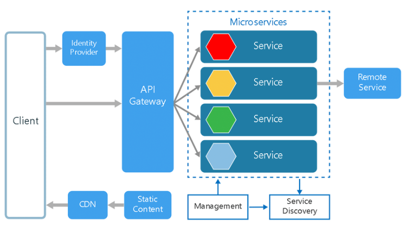
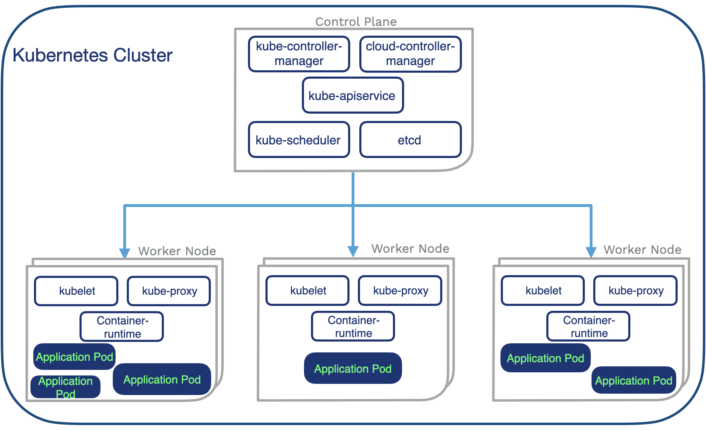
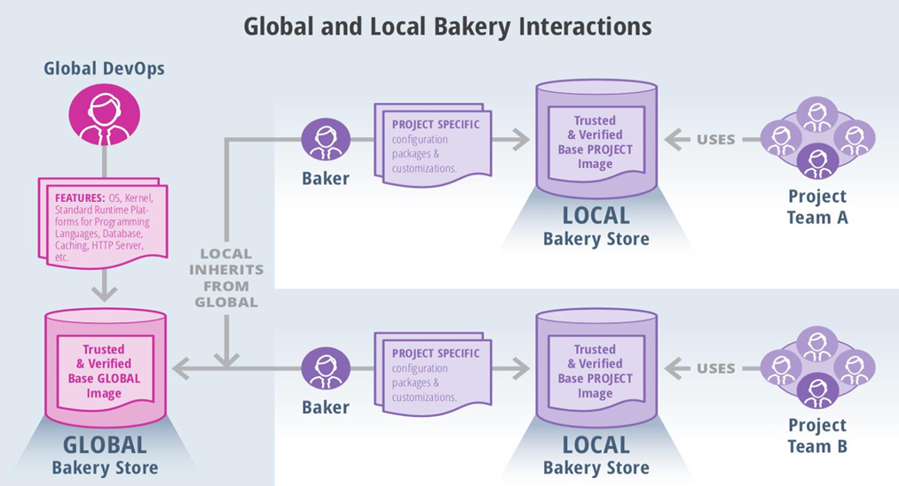

##  What is Microservices? (Up to 4 Marks)**

Microservices architecture is a software development approach where a large application is broken down into smaller, independent units called **microservices**. Each microservice is dedicated to a specific function or feature within the application. 

These microservices work together but can be developed, updated, and scaled individually, providing resilience and flexibility to the overall software system.

Each microservice is designed to handle a distinct operation or feature, contributing to the larger application, which can then be managed and deployed as a collection of small services.

The diagram of microservices architecture below shows how each microservice interacts with others through simple interfaces to resolve business problems.

## Overview of Microservices Architecture

Microservices architecture is a collection of small, autonomous services. Each service is self-contained, executing a specific business capability within a defined context. 

A **bounded context** is a division of the business domain that sets the boundaries for each service and the data model it uses.

## Uses of Microservices Architecture

Microservices architecture is commonly used to speed up application development. For example, **Spring Boot-based microservices** are widely used in Java-based environments.

While microservices and service-specific architectures both break up monolithic applications into smaller components, they take different approaches. Here are a few examples where microservices architecture shines:

### Use Cases:
- **Website Migration:** Migrating complex websites from monolithic platforms to container-based or cloud-based microservices systems.
- **Media Content:** Storing and serving images and video assets directly from scalable storage via microservices.
- **Transactions and Invoices:** Splitting payment processing and invoicing into separate services, allowing payments to be processed even if the invoicing system is down.
- **Data Processing:** Modular data processing with services that can be independently developed, managed, and executed in a cloud environment.

## Key Characteristics of Microservices

### Single Responsibility Principle
Each microservice focuses on one specific business function, promoting **modularity** and **reusability**.

### Independence
Microservices can be deployed and updated independently, ensuring no dependency on other services.

### Communication
Microservices communicate using lightweight protocols like **gRPC**, **HTTP/REST**, or messaging systems like **Kafka** and **RabbitMQ**.

### Decentralized Data Management
Each service has its own database, ensuring data autonomy and isolation.

### Polyglot Development
Microservices can be developed using different frameworks and programming languages, making it easier to choose the best tool for each service.

## Benefits of Microservices Architecture

### Scalability
Microservices allow for independent scaling based on the demand for specific application features. This enables optimized resource usage, cost measurement, and ensures availability during high-demand periods.

### Agility
Teams working on individual services can operate autonomously, reducing development cycles and improving overall throughput.

### Resilience
Since each service is independent, failures in one microservice do not affect the entire application. Unlike monolithic systems, where a failure can cause the entire system to crash, microservices handle partial failures without compromising the overall system.

### Technological Flexibility
Microservices allow teams to use different tech stacks and tools for different services. This enables more room for experimentation and innovation, as each service can leverage the technology best suited for its function.

### CI/CD Support
Microservices are well-suited for **Continuous Integration** (CI) and **Continuous Delivery/Deployment** (CD) processes. These practices enable faster deployment cycles by automating testing, integration, and delivery, ensuring a more efficient development workflow.

## How Large Applications Benefit from Microservices Architecture

Microservices architecture offers several advantages for large-scale applications. Major organizations like **Netflix**, **Amazon**, **Spotify**, and **PayPal** leverage microservices for several reasons:

### 1. Independent Scaling
Each service can be scaled independently to meet its specific demand. For example, during peak sales periods, the product catalog service might need more resources, while the user management service remains unaffected.

### 2. Faster Development Cycles
Microservices enable parallel development, allowing different teams to work on various services without waiting for others. Automated testing and CI/CD pipelines speed up development and deployment, reducing downtime and increasing release frequency.

### 3. Fault Isolation
Microservices ensure that failures in one service do not cascade and cause system-wide outages. Circuit breakers help prevent communication with faulty services, further isolating problems.

### 4. Adaptability to New Technologies
With polyglot programming, each microservice can be developed in the best-suited technology for its function. Additionally, teams can migrate individual services to new technologies without needing to rewrite the entire application.

### 5. Maintainability and Modularity
Microservices follow the **Single Responsibility Principle**, which keeps services focused on specific business capabilities. This makes codebases easier to maintain, troubleshoot, and update.

### 6. Handling Complexity
Microservices allow for **Domain-Driven Design (DDD)**, where the application is decomposed into manageable components, each aligned with specific business domains.

### 7. Global Distribution
Services can be deployed across regions to reduce latency. For instance, services like CDN and authentication can be placed closer to users to improve speed and responsiveness.

### 8. Security and Compliance
Each microservice can be isolated and secured according to its specific requirements. For example, payment services can have stricter security protocols than other non-sensitive services. **API gateways** can enforce centralized security measures like authentication and rate limiting.

### 9. Monitoring and Observability
Each service can be monitored independently, providing valuable insights into performance and error rates. Distributed systems can offer end-to-end visibility into request flows, aiding in troubleshooting and performance optimization.

### 10. Reduced Deployment Risk
**Blue/Green deployments** and **canary releases** minimize risk by rolling out updates gradually. Automated rollbacks quickly detect and revert to stable versions in case of failure.

## How Netflix Uses Microservices Architecture to Enhance Customer Experience

**Netflix** adopted microservices architecture to overcome limitations in their monolithic system. 

### The Problem:
- Slow release cycles
- Limited scalability
- Frequent outages due to tightly coupled services

### The Solution:
- Netflix migrated to over 500 microservices, enabling independent service management and scaling.
- Services were optimized for specific tasks, such as **video encoding** and **recommendation engines**, leading to improved user experience.

### The Results:
- Seamless and scalable streaming service powered by microservices.
- Faster innovation and deployment cycles.
- Enhanced fault isolation and resilience in the system.

## Conclusion

Microservices architecture brings significant benefits, especially for large-scale applications. While it introduces some complexity, proper implementation with a strong **DevOps culture**, strategic planning, and effective monitoring can help organizations maximize the advantages.

By improving **agility**, **scalability**, and **resilience**, microservices are ideal for large, flexible applications. If you're considering microservices for your next project, expert guidance from a web development services company can help ensure success.

### 🔍 Characteristics of Microservices:

| Feature                       | Description                                                            |
| ----------------------------- | ---------------------------------------------------------------------- |
| **Decentralization**          | Each service manages its own database and logic.                       |
| **Autonomy**                  | Services can be built and deployed independently.                      |
| **Resilience**                | Failure in one service doesn't impact the entire system.               |
| **Polyglot Programming**      | Developers can use different technologies for each microservice.       |
| **DevOps Friendly**           | Ideal for CI/CD pipelines and agile development.                       |
| **Lightweight Communication** | Services communicate over REST APIs or messaging systems (like Kafka). |

Microservices aim to increase agility, scalability, and resilience in complex, distributed applications.

---

## **Diagrammatic Representation of Microservices Architecture (Up to 8 Marks)**

A typical microservices architecture includes multiple services like:

* User service
* Product service
* Order service
* Payment service
* API Gateway
* Frontend UI

These services communicate over HTTP (REST), message queues (Kafka/RabbitMQ), or gRPC.

### 📌 Diagram Link:





#### 🔍 Key Components:

* **API Gateway**: Entry point for clients, handles routing and authentication.
* **Independent Services**: Each microservice handles its own database and logic.
* **Service Communication**: RESTful APIs or event streaming.
* **Decentralized Databases**: Services do not share databases; they own their data.

---

## **How Docker Supports Microservices Architecture (Up to 8 Marks)**

Docker containers are the **perfect fit** for microservices due to their lightweight, isolated, and portable nature.

### 🔧 Docker Advantages for Microservices:

| Capability          | Description                                                               |
| ------------------- | ------------------------------------------------------------------------- |
| **Isolation**       | Each microservice runs in its own container, avoiding conflicts.          |
| **Portability**     | Containers can run on any platform (Dev, QA, Prod).                       |
| **Fast Scaling**    | Spin up multiple containers for any microservice based on demand.         |
| **DevOps Friendly** | Docker supports automation using Dockerfiles, Compose, and CI/CD tools.   |
| **Lightweight**     | Containers share the host OS kernel, making them more efficient than VMs. |

---

## **Kubernetes + Docker: Microservices Deployment Architecture**

When combined with **Kubernetes**, Docker provides production-grade orchestration for containerized microservices.

### ⚙️ Kubernetes Components in Microservices:

| Kubernetes Component | Purpose                                                      |
| -------------------- | ------------------------------------------------------------ |
| **Pod**              | Basic unit of deployment, typically runs a single container. |
| **Deployment**       | Manages desired state, rolling updates, and replicas.        |
| **Service**          | Stable network endpoint to expose pods.                      |
| **Ingress**          | Controls external HTTP access to services.                   |
| **ConfigMap/Secret** | Externalize configuration and credentials.                   |
| **Namespace**        | Organizes services and environments (dev, staging, prod).    |

---

### 📌 Diagram Link:




### 🧪 Real-World Workflow:

1. **Frontend Service** sends a request to an **API Gateway**.
2. Gateway routes to **OrderService**, which pulls customer data from **UserService**.
3. If payment is required, it calls the **PaymentService**.
4. Services are deployed as individual containers managed by **Kubernetes deployments**.
5. Services talk via **Kubernetes services** (cluster-internal DNS).
6. Logs are collected using tools like **ELK or Fluentd**; monitoring via **Prometheus + Grafana**.

---

## ✅ Summary

Microservices architecture improves **modularity**, **deployment velocity**, and **resilience** in applications. **Docker** helps by packaging services into isolated containers, while **Kubernetes** ensures these containers are orchestrated, scaled, and managed efficiently.

Docker + Kubernetes form the foundation of **cloud-native microservice deployments** — enabling **CI/CD**, **auto-scaling**, **self-healing**, and **observability**.

---

-------------------------------------------------------------------------------------------------------------------------------------------------------

## Explain the concept of Docker Bakery 

### 🔍 What is Docker Bakery?

**Docker Bakery** refers to a CI/CD pipeline design pattern for building and managing container images in a repeatable, automated, and versioned manner. The term "bakery" comes from the analogy of *baking* Docker images — i.e., producing pre-built, pre-tested images that are ready to be deployed.

It contrasts with **just-in-time image builds** (building during deployment), by focusing on **pre-baked images** that are:

* Version-controlled
* Built centrally
* Stored in a registry
* Promoted through dev → staging → production

### 🔧 Core Idea:

Instead of building an image every time a container is deployed, the Docker Bakery model **bakes (builds)** the image once, tests it, and then promotes it across environments.


### 🧱 Docker Bakery Workflow:

1. **Source Code Check-in** triggers pipeline.
2. **Docker Build Stage** creates versioned image.
3. **Test Stage** runs unit/integration tests on the baked image.
4. **Store in Registry** like Docker Hub or AWS ECR.
5. **Promote Image** to higher environments without rebuilding.

---


# Bakery Interaction



This image titled **"Global and Local Bakery Interactions"** illustrates how **container image creation and customization** is managed in a **multi-layered DevOps environment** using a bakery model. It highlights **inheritance**, **customization**, and **reuse** of trusted base images to support **multiple local project teams**.

Let’s break it down:


---

## 🔹 1. **Global Bakery Store & Global DevOps Team**
- **Role**: The **Global DevOps team** is responsible for building a **Trusted & Verified Base GLOBAL Image**.
- **Contents/Features** (shown in the pink box):
  - Operating System (OS)
  - Kernel
  - Standard Runtime Platforms for:
    - Programming Languages (e.g., Python, Java, Node.js)
    - Databases
    - Caching systems (e.g., Redis)
    - Web/HTTP servers (e.g., NGINX, Apache)
- **Purpose**: These foundational components are standardized, hardened for security, and verified.

✅ **Output**: The image is stored in the **Global Bakery Store** for downstream use.

---

## 🔸 2. **Local Inheritance from Global**
- **Process**:
  - Local environments **inherit** the global base image.
  - This ensures **consistency** and **security** across all projects, regardless of local modifications.
- **Why It’s Important**:
  - Avoids duplication of effort.
  - Ensures all projects start from a common, secure baseline.

---

## 🟣 3. **Baker (Local DevOps Engineer)**
- **Who They Are**: DevOps engineers or image maintainers responsible for tailoring the global image to fit local needs.
- **What They Do**:
  - Apply **project-specific** configuration, packages, and customizations (e.g., app dependencies, monitoring tools).
- **Tools Used**: Likely use Dockerfiles, automation scripts, and CI/CD pipelines to perform this customization.

---

## 🔸 4. **Trusted & Verified Base Project Image**
- **What It Is**: The result of applying local customizations to the inherited global image.
- **Stored In**: The **Local Bakery Store**.
- **Trust Layer**:
  - Even though customizations are added, the image is **verified and trusted locally**, often with added internal policies.

---

## 🔹 5. **Project Teams (Team A, Team B, etc.)**
- **Who They Are**: Application developers, QA engineers, or other contributors working on specific projects.
- **What They Use**: The **Trusted & Verified Base Project Image** to build and run their applications.
- **Benefits**:
  - No need to worry about OS/runtime/security layers.
  - They inherit all improvements from both global and local levels.

---

## 🧩 Key Concepts:
| Concept | Description |
|--------|-------------|
| **Inheritance** | Local images are built **on top of** global base images. |
| **Customization** | Local teams can add project-specific tools and configurations. |
| **Trust & Verification** | Both global and local images go through a trust validation process. |
| **Reuse** | Multiple teams can reuse locally customized base images. |

---

### 📝 Summary:
This model showcases a **modular, scalable, and secure approach** to managing container images across multiple teams:
- **Global Team** standardizes the base.
- **Local Teams** customize per project.
- **Project Teams** deploy with speed and confidence using trusted images.

## **Example: Python Flask App using Docker Bakery (Up to 5 Marks)**

Here’s a **sample Dockerfile** to bake a Python Flask app:

```dockerfile
# Dockerfile
FROM python:3.9-slim

WORKDIR /app

COPY requirements.txt .

RUN pip install --no-cache-dir -r requirements.txt

COPY . .

CMD ["python", "app.py"]
```

This image can be baked once, tested, and pushed to a Docker registry like:

```bash
docker build -t bakery/flask-app:1.0 .
docker run --rm bakery/flask-app:1.0
docker push bakery/flask-app:1.0
```

In CI/CD (e.g., GitHub Actions or Jenkins), this can be automated using:

* `docker build`
* `docker scan` (for vulnerabilities)
* `docker push`
* Promote to QA/UAT/Production environments

---

## **Best Practices for Docker Bakery (Up to 5 Marks)**

| Best Practice                   | Explanation                                                            |
| ------------------------------- | ---------------------------------------------------------------------- |
| **Version Your Images**         | Use semantic tags (e.g., `v1.0.2`) instead of `latest`.                |
| **Centralized Builds**          | Build and store images in a CI/CD pipeline, not at deployment time.    |
| **Immutable Images**            | Never mutate baked images once created. Build new images for updates.  |
| **Security Scans**              | Scan baked images using tools like `Trivy`, `Docker Scan`, or `Clair`. |
| **Promote Artifacts, Not Code** | Test once, deploy same artifact across environments.                   |


