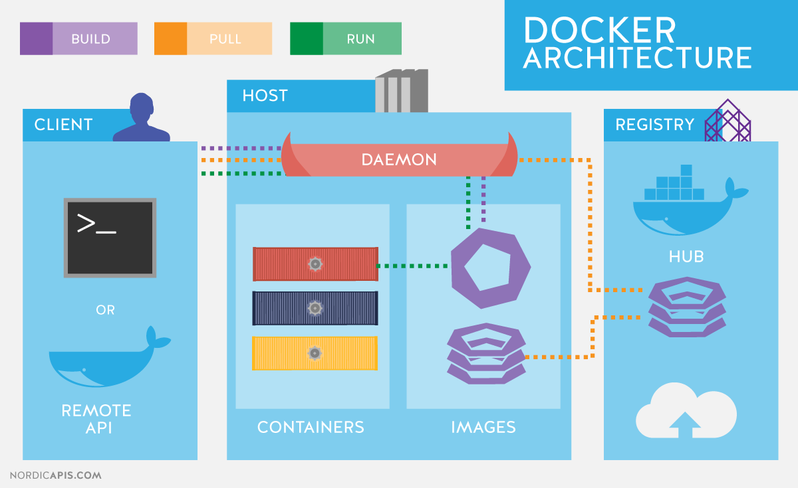
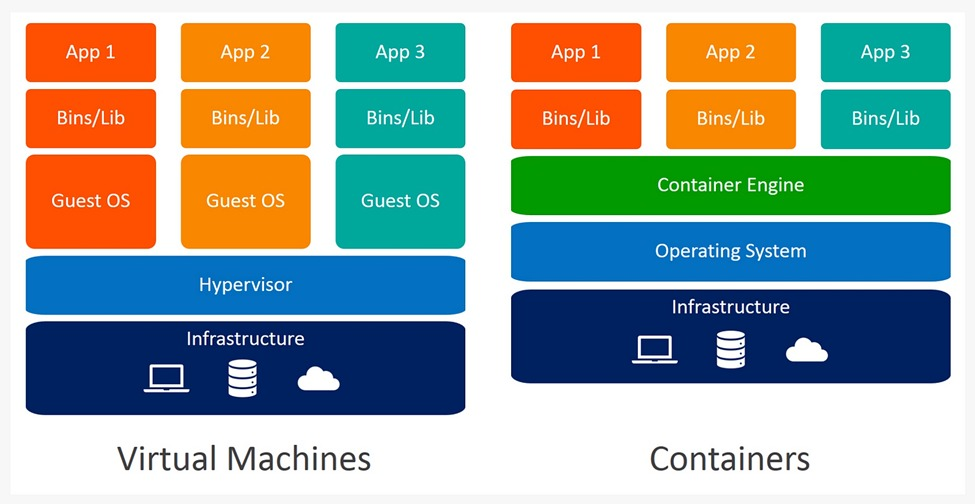
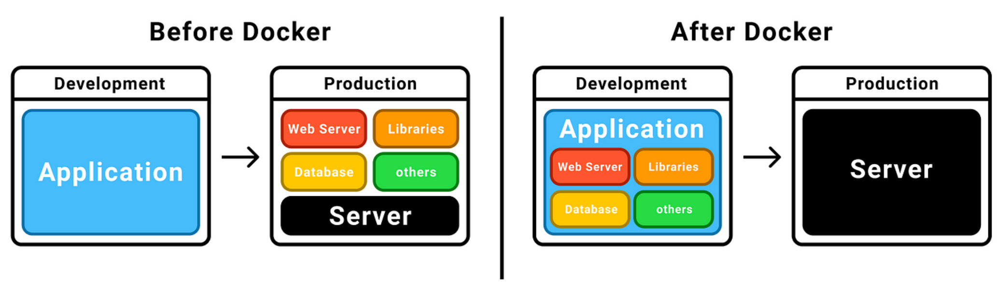
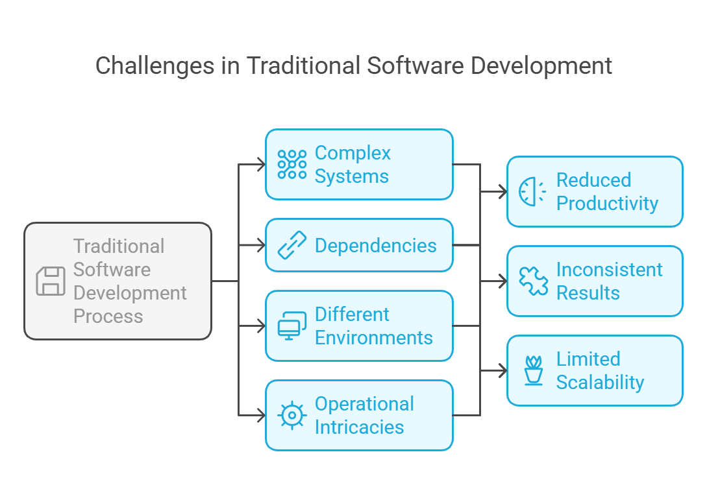
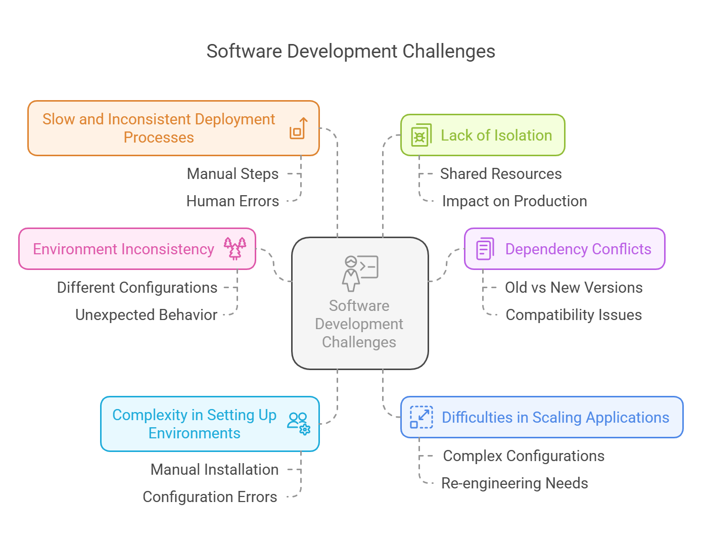
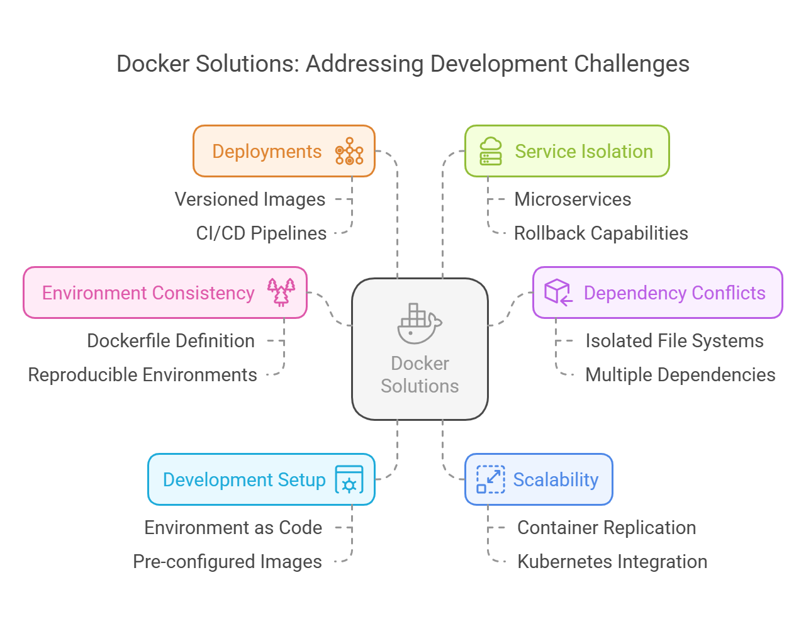

# What is Docker?

Docker is an open-source platform that automates the deployment, scaling, and management of applications inside lightweight containers. A **container** is a standardized unit of software that packages up code and all its dependencies so the application can run quickly and reliably in any computing environment.

# Docker Architecture

Docker is a platform for developing, shipping, and running applications in containers. It enables developers to package applications and their dependencies into a container, ensuring that the application works seamlessly across different environments.

## Docker Architecture Overview

The architecture of Docker can be broken down into several key components. These components work together to enable Docker's core functionalities. Here's an overview:

### Key Components of Docker Architecture:
1. **Docker Engine**: This is the core part of Docker, responsible for creating, running, and managing containers. It includes:
   - **Docker Daemon (`dockerd`)**: The background service that manages Docker containers.
   - **Docker CLI (`docker`)**: The command-line interface that allows users to interact with the Docker Daemon.
   
2. **Docker Images**: These are read-only templates used to create containers. They contain everything needed to run an application, such as the code, runtime, libraries, and environment variables.

3. **Docker Containers**: A container is a running instance of a Docker image. It is an isolated environment where applications run. Each container is lightweight, and they share the host system's OS kernel.

4. **Docker Registries**: A registry is where Docker images are stored. Docker Hub is the default public registry, but private registries can also be used.

5. **Docker Network**: Containers can communicate with each other and with the outside world via networks. Docker provides several network drivers, such as bridge, host, and overlay networks, to manage container communication.

6. **Docker Volumes**: Volumes are used to persist data generated by and used by Docker containers. They are stored outside of containers, ensuring that data is not lost when containers are stopped or removed.

### Docker Architecture Diagram

Below is a visual representation of the Docker architecture:

This diagram illustrates the relationship between the key components mentioned above. The Docker Daemon runs on the host machine and manages the creation and execution of containers. Users interact with Docker through the CLI, while the images and containers reside in the system's filesystem. The Docker registry holds the images, making it easier for users to pull and push images from a centralized location.

### How Docker Works

1. The **Docker CLI** sends requests to the Docker Daemon.
2. The Docker Daemon pulls or pushes Docker images from or to the Docker Registry.
3. The Docker Daemon creates containers from Docker images.
4. Containers run isolated from one another, but can communicate over Docker Networks.
5. Volumes provide persistent storage to containers, ensuring that the data survives container restarts.

### Conclusion

Docker's architecture is designed to provide an efficient and consistent way to develop, ship, and run applications. By understanding the various components and how they interact, you can leverage Docker to streamline the development and deployment of applications.

---

# What Docker Isn’t

Before diving into what Docker is, it's important to clarify what Docker **isn't**. Docker is often confused with virtualization technologies, but it operates in a fundamentally different way. Here's a breakdown of how Docker differs from traditional virtualization:

## Docker vs Virtualization

### Docker Containers:
- **Share the host operating system (OS) kernel**:
  - Docker containers run on the same OS kernel as the host machine, meaning they do not require their own separate operating system.
  - The containers are isolated from one another but run on the same OS instance.
  
- **Lighter and more efficient**:
  - Since Docker containers don't need to boot a full OS like virtual machines (VMs), they use fewer resources.
  - Containers are smaller, start faster, and use less overhead compared to VMs.
  
- **No separate OS per instance**:
  - Unlike VMs, which require a full OS per instance, Docker containers share the underlying host OS, making them more lightweight.

### Virtual Machines (VMs):
- **Run their own OS**:
  - Each VM includes its own full operating system (OS), separate from the host OS, along with its own kernel.
  - Virtual machines are heavier, as they need to boot up an entire OS and run it in a fully isolated environment.
  
- **Higher resource consumption**:
  - VMs require more resources (CPU, RAM, disk space) due to the overhead of running separate operating systems.

### Docker and Hypervisors:
- Docker does **not** replace a hypervisor (such as VMware, Hyper-V, or KVM) directly.
- **Docker runs in virtualized environments**:
  - Docker can run on top of a VM if needed, but it does not replace or directly compete with a hypervisor.
  - It can complement virtualized environments by providing greater flexibility, efficiency, and portability for applications.

## Summary:
- Docker containers are not virtual machines; they are a lightweight alternative that shares the host OS kernel.
- Docker is more efficient than VMs because it doesn't require a separate OS for each container.
- Docker does not replace virtualization technologies but can run within virtualized environments to extend capabilities.

---

# Is Docker a Virtual Machine?

No, Docker is **not** a virtual machine. While both Docker and virtual machines are technologies used to isolate applications, they operate in fundamentally different ways. Here's how Docker compares to virtual machines:

### Virtual Machines (VMs):
- **Separate OS and Kernel**: VMs run their own full operating system (OS), which includes a separate kernel from the host machine.
- **Resource Overhead**: Since each VM includes its own OS and kernel, VMs tend to use more resources, such as CPU, RAM, and disk space.
- **Isolation at the Hardware Level**: VMs provide full isolation from the host and other VMs, running an entirely separate environment.

### Docker Containers:
- **Share Host OS Kernel**: Docker containers share the host OS kernel, meaning they don’t need to include their own OS. Containers are isolated at the application layer, not the hardware layer.
- **Lightweight and Efficient**: Docker containers are lightweight because they don’t require a separate OS for each instance, which makes them faster to start and use fewer resources compared to VMs.
- **Isolation at the Application Layer**: Containers are isolated from each other, but they share the same underlying kernel, making them much more efficient than VMs.

# How Does Docker Help Developers?

Docker offers numerous benefits that streamline the development process and help developers work more efficiently:

### 1. **Environment Consistency**:
   - Developers can create a Docker container that includes all the necessary dependencies (e.g., libraries, runtime, environment variables) for their application.
   - This ensures that the application behaves the same way regardless of the environment (local machine, testing server, production, etc.).

### 2. **Simplified Setup**:
   - Developers no longer need to manually configure environments on each system.
   - Docker automates environment setup, allowing developers to easily replicate the environment across multiple machines without worrying about system-specific configurations.

### 3. **Portability**:
   - Docker containers allow developers to package applications along with their environment, making it easy to build and ship them.
   - A Docker container can run anywhere: on the developer's laptop, on a testing server, or in the cloud, making Docker a truly portable solution for developers.

### 4. **Faster Development**:
   - Docker enables the quick setup of development environments. Developers can rapidly spin up containers for testing, development, or staging, reducing the setup time.
   - This leads to faster iteration, less manual configuration, and an overall smoother development experience.

### 5. **Microservices-Friendly**:
   - Developers can split monolithic applications into small, independently deployable microservices, each running in its own container. This makes the application more modular and easier to scale.

### 6. **Cross-Platform Compatibility**:
   - Docker eliminates issues where an application works on one machine but fails on another due to environmental differences.

## Summary:
- **Docker vs Virtual Machines**: Docker is not a virtual machine. While VMs require separate OS and kernel instances, Docker containers share the host OS kernel, making them more lightweight and efficient.
- **Docker for Developers**: Docker helps developers by providing consistent environments, automating setup, offering portability across systems, and accelerating the development process.

---

# What is Development and Deployment burdens?

The traditional software development and deployment process can present various challenges and burdens that can hinder productivity, consistency, and scalability. These challenges are mainly due to the complexity of the systems, dependencies, environments, and the operational intricacies involved. Docker, with its containerization approach, has emerged as a solution to many of these burdens, streamlining development and deployment pipelines.

## Development and Deployment Burdens in Traditional Software Development:

### 1. Environment Inconsistency:
**Problem:** Developers typically work on their local machines with a specific environment, while the production servers or staging environments may have a different configuration. This discrepancy leads to bugs that only appear when the software is deployed in a different environment, causing delays and frustration.

**Example:** A developer uses a specific version of a database or operating system libraries that differs from the ones in production, leading to unexpected behavior or crashes when deployed.

### 2. Dependency Conflicts:
**Problem:** Many applications depend on specific versions of libraries or frameworks. Managing these dependencies across different development machines and environments can become complex, especially when different applications use incompatible versions of the same library.

**Example:** One application might depend on an old version of a database connector, while another needs the latest version, making it difficult to run both applications on the same system without conflicts.

### 3. Complexity in Setting Up Development Environments:
**Problem:** Developers need to manually install and configure various software packages, libraries, databases, and other components to get a development environment up and running. This process can be time-consuming and prone to errors.

**Example:** A new developer joining a project might struggle to set up their environment correctly, requiring a lot of time to resolve configuration issues.

### 4. Difficulties in Scaling Applications:
**Problem:** Scaling a traditional application involves complex configurations, ensuring the infrastructure can handle increased load. If the application is not designed for scalability, it might require significant re-engineering to scale efficiently.

**Example:** In cloud environments, scaling individual components like web servers or databases without disrupting the overall application can be a tricky and error-prone process.

### 5. Slow and Inconsistent Deployment Processes:
**Problem:** Traditional software deployments often involve manual steps such as copying files to servers, setting up environments, running migrations, and configuring services. These steps are time-consuming, error-prone, and difficult to repeat consistently.

**Example:** Deploying updates in a manual process can result in human errors, such as missing configurations or failing to properly migrate databases.

### 6. Lack of Isolation:
**Problem:** In traditional setups, different services often share the same host machine, leading to resource contention and difficulty isolating services or testing specific components.

**Example:** A database update might affect the rest of the system, making it hard to test new versions of components without impacting production services.

## How Docker Solves These Burdens:

### 1. Environment Consistency:
**Solution:** Docker containers allow developers to define the environment (e.g., operating system, libraries, and dependencies) within a Dockerfile. This ensures that the application will run the same way on any system that supports Docker, from a developer's machine to staging and production environments.

**How Docker Helps:** By packaging the application and its environment into a container image, Docker guarantees that the application will behave consistently across any environment. The "works on my machine" problem is eliminated since the container provides a reproducible and isolated environment.

### 2. Eliminating Dependency Conflicts:
**Solution:** Docker containers include all the necessary dependencies (e.g., libraries, frameworks, runtimes) within the container, isolating them from the host system and other containers. This prevents conflicts between different applications that might require different versions of the same dependency.

**How Docker Helps:** Each container has its own isolated file system, libraries, and environment variables, ensuring that dependencies do not interfere with each other. Developers can run multiple containers with different dependencies on the same host without conflict.

### 3. Simplified Development Environment Setup:
**Solution:** Docker enables developers to define their environments as code (using a Dockerfile and docker-compose.yml), allowing new developers to set up their environment quickly by pulling pre-configured images from a container registry (such as Docker Hub).

**How Docker Helps:** New developers can avoid the time-consuming process of manually configuring environments. Instead, they can simply run a few commands to pull the necessary containers, ensuring a consistent setup without manual intervention.

### 4. Scalability:
**Solution:** Docker makes it easier to scale applications horizontally. Containers can be easily replicated across multiple servers or cloud environments. Docker also integrates well with container orchestration systems like Kubernetes, which automates scaling, load balancing, and management of containers.

**How Docker Helps:** With Docker, scaling services becomes as simple as running additional container instances. This makes it easier to manage applications in production, ensuring they can handle increased loads without requiring complex changes to the architecture.

### 5. Automated and Consistent Deployments:
**Solution:** Docker images can be versioned and stored in a registry. This allows for automated continuous integration/continuous deployment (CI/CD) pipelines that ensure the latest version of the application is always deployed in a consistent and repeatable manner.

**How Docker Helps:** The process of building, testing, and deploying applications can be automated, reducing manual intervention. The same Docker image used in testing is deployed in production, ensuring that no changes occur during the deployment process.

### 6. Service Isolation:
**Solution:** Docker containers provide strong isolation, which means each container runs independently and does not interfere with others. This is especially useful for running microservices or testing multiple versions of an application simultaneously.

**How Docker Helps:** By isolating services in separate containers, developers can run different services with different configurations without worrying about conflicts. Additionally, Docker makes it easier to roll back changes if something goes wrong since each container is self-contained.

## Additional Docker Advantages:

- **Portability:** Docker containers can be run on any machine that has Docker installed, whether it's a local machine, a virtual machine, or a cloud environment.
- **Lightweight:** Docker containers share the host OS kernel, making them much more lightweight than virtual machines, which need to run their own operating system.
- **Versioning and Rollback:** Docker images are versioned, so it’s easy to rollback to a previous version of an application if needed, making it easier to handle deployment failures.

## Conclusion:
Traditional software development and deployment processes are burdened by issues like environment inconsistency, dependency conflicts, complex setup procedures, scalability challenges, and inconsistent deployments. Docker, through its containerization approach, addresses many of these challenges by ensuring consistency across environments, simplifying dependency management, and enabling automated and scalable deployments. By containerizing applications and their dependencies, Docker provides a more efficient, portable, and reliable way to develop, test, and deploy software, making it an invaluable tool for modern software development.

---

For more information, you can check out the official [Docker Documentation](https://docs.docker.com/).
