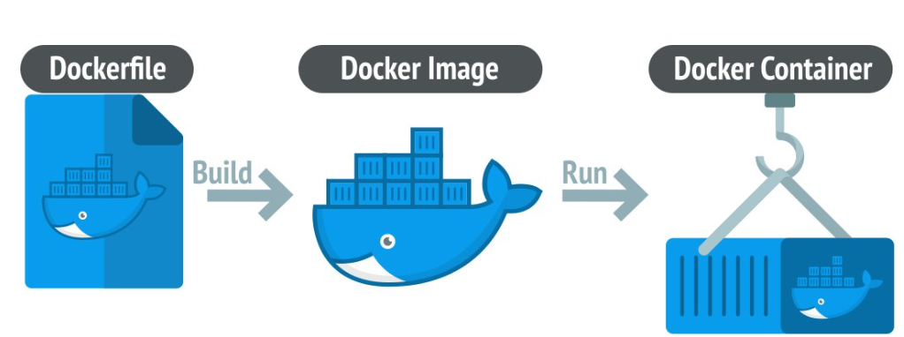

# What is a Docker File



A **Dockerfile** is a text file that contains all the instructions needed to build a Docker image for a specific application or environment. For a Python application, a Dockerfile defines how to set up the environment, install dependencies, and run the Python app in a container.

### A Basic Dockerfile for a Python Application

Here’s a simple example of a Dockerfile for a Python application.

### Example: Dockerfile for Python Application

```python
# app.py
print("Hello, World!")
```


```dockerfile
# Step 1: Use an official Python runtime as a parent image
FROM python:3.9-slim

# Step 2: Set the working directory inside the container
WORKDIR /app

# Step 3: Copy the local directory content into the container at /app
COPY . /app

# Step 4: Install any necessary dependencies (if any) from requirements.txt
RUN pip install --no-cache-dir -r requirements.txt

# Step 5: Run the Python application
CMD ["python", "app.py"]
```

### Explanation of Each Step:

1. **FROM python:3.9-slim**:
   - This sets the base image to an official Python image from Docker Hub. The version `3.9-slim` is a lightweight version of Python 3.9.
   
2. **WORKDIR /app**:
   - This sets the working directory inside the container to `/app`. Any subsequent commands will be executed relative to this directory.

3. **COPY . /app**:
   - This copies all the files from your local directory into the `/app` directory inside the container. This includes your Python script, `requirements.txt`, and any other files needed by the application.

4. **RUN pip install --no-cache-dir -r requirements.txt**:
   - This installs any Python dependencies specified in the `requirements.txt` file. The `--no-cache-dir` option ensures that pip does not store unnecessary cache, keeping the image size smaller.

5. **CMD ["python", "app.py"]**:
   - This specifies the command that will be executed when the container starts. Here, it runs the `app.py` script using Python.

### Example Directory Structure

To use the above Dockerfile, your directory might look like this:

```
/my-python-app
  ├── Dockerfile
  ├── app.py
  └── requirements.txt
```

Where:

- **`app.py`** is your Python application file (e.g., a simple script or web app).
- **`requirements.txt`** lists any Python dependencies required by your application (e.g., Flask, Django, requests).

### Example `requirements.txt`

If your application requires external libraries, like `Flask`, your `requirements.txt` might look like this:

```
Flask==2.0.1
```

### How to Build and Run the Docker Container

1. **Build the Docker image**:

   In the terminal, navigate to your project directory (where the `Dockerfile` is located) and run the following command:

   ```bash
   docker build -t python-app .
   ```

   This builds the Docker image and tags it as `python-app`.

2. **Run the Docker container**:

   After building the image, you can run the application inside a container with this command:

   ```bash
   docker run python-app
   ```

   If you have a web application (e.g., using Flask), you might need to expose a port:

   ```bash
   docker run -p 5000:5000 python-app
   ```

   This will map port `5000` on your host machine to port `5000` inside the container, which is commonly used for Flask applications.

### Conclusion

A Dockerfile for a Python application automates the process of setting up the environment, installing dependencies, and running your application inside a container. This makes it easy to deploy and run the application consistently across different environments.