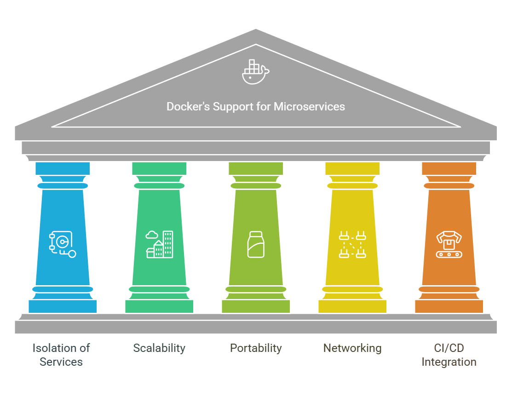
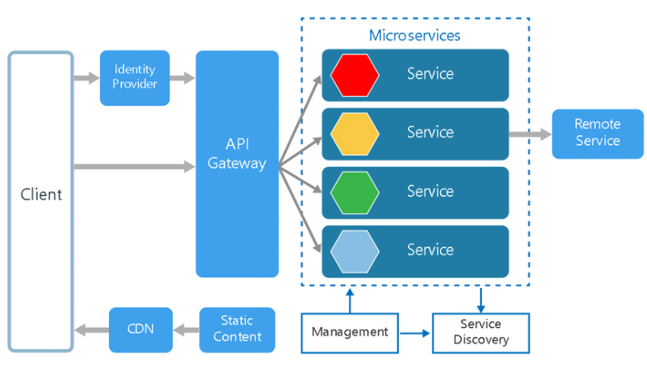
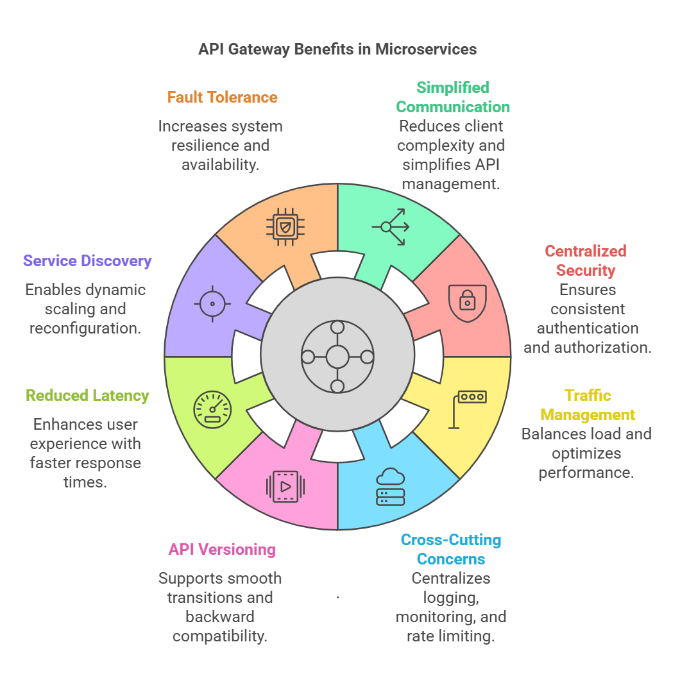

# How Docker Supports Microservices Architecture

Docker provides a powerful environment for building and managing **microservices architectures** by offering a range of features that are particularly suited for the modular and scalable nature of microservices. Here's how Docker supports microservices:

## 1. Isolation of Services
- Docker containers allow each microservice to run in its own isolated environment. This isolation means that each service can have its own dependencies, configurations, and environment variables, without interfering with other services.
- Each container can run a single microservice, which simplifies managing and updating individual components of the application.

## 2. Simplified Deployment and Management
- Docker containers package a microservice and all its dependencies into a single unit. This makes it easier to deploy microservices consistently across different environments (development, testing, production).
- With Docker, microservices can be easily deployed, updated, or scaled independently without affecting other services, providing a high level of flexibility and control.

## 3. Scalability
- Docker enables horizontal scaling of microservices. Since each container is lightweight and isolated, scaling a specific microservice is as simple as running more instances of the container.
- This is particularly useful in cloud-native applications, where Docker containers can be deployed across multiple servers or environments to handle varying levels of load.

## 4. Portability Across Environments
- Docker containers ensure that microservices run consistently across different environments (developer machines, staging, production). This eliminates the common "it works on my machine" problem, making development and deployment smoother.
- Docker containers can be easily moved across cloud environments (AWS, Azure, Google Cloud) or even between on-premises and cloud infrastructure.

## 5. Easy Communication Between Services
- Docker provides networking features that allow containers to communicate with each other. Using Docker's networking capabilities (e.g., bridge networks, overlay networks), microservices in different containers can interact seamlessly, which is essential for a microservices architecture.
- Docker Compose allows you to define multi-container applications and manage dependencies between different services, making it easier to manage complex systems built on microservices.

## 6. Version Control and Rollbacks
- Docker images are versioned, allowing you to manage and track changes to the microservices. If there are issues with a new version of a microservice, you can easily roll back to a previous version of the container.
- This version control also ensures that you can deploy different versions of microservices without breaking the entire application.

## 7. Microservices Development with Docker Compose
- Docker Compose is a tool that helps define and run multi-container applications. With Docker Compose, you can specify all the services that make up your microservices architecture (databases, APIs, frontend, etc.) and define how they should interact.
- It helps developers easily set up the environment locally with all necessary services running in different containers.

## 8. Continuous Integration/Continuous Deployment (CI/CD)
- Docker integrates well with CI/CD pipelines. You can automate the process of building, testing, and deploying microservices, ensuring that your services are always up-to-date with the latest changes.
- Containers also make it easier to run automated tests in isolated environments to ensure that individual microservices work as expected before being deployed to production.

## 9. Fault Isolation and Resilience
- Docker containers help achieve better fault isolation by running each microservice in its own container. If one service fails, it doesn’t directly impact the others.
- This makes microservices architectures more resilient to failures, as services can be restarted, updated, or scaled independently.

## 10. Resource Efficiency
- Docker containers share the host system’s OS kernel, making them more lightweight than virtual machines. This results in better resource utilization, which is critical for running many microservices concurrently on the same host.

## 11. Support for Orchestration Tools
- Tools like **Kubernetes**, **Docker Swarm**, and **Amazon ECS** can be used to orchestrate and manage Docker containers at scale. These tools help automate the deployment, scaling, load balancing, and management of microservices in production environments.
- With orchestration, Docker can support complex microservices architectures by ensuring that each service is deployed and scaled according to demand.

## Summary of Docker's Support for Microservices:
- **Isolation**: Each microservice runs in its own container.
- **Scalability**: Easily scale microservices by running multiple container instances.
- **Portability**: Ensure consistent behavior across different environments.
- **Networking**: Facilitate communication between containers/services.
- **Versioning and Rollbacks**: Control and revert versions of microservices easily.
- **CI/CD**: Docker integrates into CI/CD pipelines for automated testing and deployment.
- **Fault Isolation**: Microservices are isolated, reducing the risk of cascading failures.

By leveraging Docker's features, organizations can implement microservices architectures more effectively, leading to easier deployment, maintenance, and scaling of complex applications.
---
---
# What is Microservices Architecture?

Microservices architecture is a software development approach where a large application is broken down into smaller, independent units called **microservices**. Each microservice is dedicated to a specific function or feature within the application. 

These microservices work together but can be developed, updated, and scaled individually, providing resilience and flexibility to the overall software system.

Each microservice is designed to handle a distinct operation or feature, contributing to the larger application, which can then be managed and deployed as a collection of small services.

The diagram of microservices architecture below shows how each microservice interacts with others through simple interfaces to resolve business problems.

## Overview of Microservices Architecture

Microservices architecture is a collection of small, autonomous services. Each service is self-contained, executing a specific business capability within a defined context. 

A **bounded context** is a division of the business domain that sets the boundaries for each service and the data model it uses.

## Uses of Microservices Architecture

Microservices architecture is commonly used to speed up application development. For example, **Spring Boot-based microservices** are widely used in Java-based environments.

While microservices and service-specific architectures both break up monolithic applications into smaller components, they take different approaches. Here are a few examples where microservices architecture shines:

### Use Cases:
- **Website Migration:** Migrating complex websites from monolithic platforms to container-based or cloud-based microservices systems.
- **Media Content:** Storing and serving images and video assets directly from scalable storage via microservices.
- **Transactions and Invoices:** Splitting payment processing and invoicing into separate services, allowing payments to be processed even if the invoicing system is down.
- **Data Processing:** Modular data processing with services that can be independently developed, managed, and executed in a cloud environment.

## Key Characteristics of Microservices

### Single Responsibility Principle
Each microservice focuses on one specific business function, promoting **modularity** and **reusability**.

### Independence
Microservices can be deployed and updated independently, ensuring no dependency on other services.

### Communication
Microservices communicate using lightweight protocols like **gRPC**, **HTTP/REST**, or messaging systems like **Kafka** and **RabbitMQ**.

### Decentralized Data Management
Each service has its own database, ensuring data autonomy and isolation.

### Polyglot Development
Microservices can be developed using different frameworks and programming languages, making it easier to choose the best tool for each service.

## Benefits of Microservices Architecture

### Scalability
Microservices allow for independent scaling based on the demand for specific application features. This enables optimized resource usage, cost measurement, and ensures availability during high-demand periods.

### Agility
Teams working on individual services can operate autonomously, reducing development cycles and improving overall throughput.

### Resilience
Since each service is independent, failures in one microservice do not affect the entire application. Unlike monolithic systems, where a failure can cause the entire system to crash, microservices handle partial failures without compromising the overall system.

### Technological Flexibility
Microservices allow teams to use different tech stacks and tools for different services. This enables more room for experimentation and innovation, as each service can leverage the technology best suited for its function.

### CI/CD Support
Microservices are well-suited for **Continuous Integration** (CI) and **Continuous Delivery/Deployment** (CD) processes. These practices enable faster deployment cycles by automating testing, integration, and delivery, ensuring a more efficient development workflow.

## How Large Applications Benefit from Microservices Architecture

Microservices architecture offers several advantages for large-scale applications. Major organizations like **Netflix**, **Amazon**, **Spotify**, and **PayPal** leverage microservices for several reasons:

### 1. Independent Scaling
Each service can be scaled independently to meet its specific demand. For example, during peak sales periods, the product catalog service might need more resources, while the user management service remains unaffected.

### 2. Faster Development Cycles
Microservices enable parallel development, allowing different teams to work on various services without waiting for others. Automated testing and CI/CD pipelines speed up development and deployment, reducing downtime and increasing release frequency.

### 3. Fault Isolation
Microservices ensure that failures in one service do not cascade and cause system-wide outages. Circuit breakers help prevent communication with faulty services, further isolating problems.

### 4. Adaptability to New Technologies
With polyglot programming, each microservice can be developed in the best-suited technology for its function. Additionally, teams can migrate individual services to new technologies without needing to rewrite the entire application.

### 5. Maintainability and Modularity
Microservices follow the **Single Responsibility Principle**, which keeps services focused on specific business capabilities. This makes codebases easier to maintain, troubleshoot, and update.

### 6. Handling Complexity
Microservices allow for **Domain-Driven Design (DDD)**, where the application is decomposed into manageable components, each aligned with specific business domains.

### 7. Global Distribution
Services can be deployed across regions to reduce latency. For instance, services like CDN and authentication can be placed closer to users to improve speed and responsiveness.

### 8. Security and Compliance
Each microservice can be isolated and secured according to its specific requirements. For example, payment services can have stricter security protocols than other non-sensitive services. **API gateways** can enforce centralized security measures like authentication and rate limiting.

### 9. Monitoring and Observability
Each service can be monitored independently, providing valuable insights into performance and error rates. Distributed systems can offer end-to-end visibility into request flows, aiding in troubleshooting and performance optimization.

### 10. Reduced Deployment Risk
**Blue/Green deployments** and **canary releases** minimize risk by rolling out updates gradually. Automated rollbacks quickly detect and revert to stable versions in case of failure.

## How Netflix Uses Microservices Architecture to Enhance Customer Experience

**Netflix** adopted microservices architecture to overcome limitations in their monolithic system. 

### The Problem:
- Slow release cycles
- Limited scalability
- Frequent outages due to tightly coupled services

### The Solution:
- Netflix migrated to over 500 microservices, enabling independent service management and scaling.
- Services were optimized for specific tasks, such as **video encoding** and **recommendation engines**, leading to improved user experience.

### The Results:
- Seamless and scalable streaming service powered by microservices.
- Faster innovation and deployment cycles.
- Enhanced fault isolation and resilience in the system.

## Conclusion

Microservices architecture brings significant benefits, especially for large-scale applications. While it introduces some complexity, proper implementation with a strong **DevOps culture**, strategic planning, and effective monitoring can help organizations maximize the advantages.

By improving **agility**, **scalability**, and **resilience**, microservices are ideal for large, flexible applications. If you're considering microservices for your next project, expert guidance from a web development services company can help ensure success.

---
---
---

# Advantages of Using an API Gateway in Microservices

In a microservices architecture, an **API Gateway** serves as a single entry point for all client requests, which are then routed to the appropriate microservice. The API Gateway acts as an intermediary that simplifies communication between the client and the microservices by providing a unified interface.

Here are the main advantages of using an API Gateway in microservices architecture:

## 1. **Simplified Client Communication**
The API Gateway consolidates requests for different microservices into a single entry point. This simplifies the client-side logic, as clients no longer need to interact with each individual microservice. Instead, they make a single call to the API Gateway, which forwards the request to the appropriate service.

### Benefit:
- Reduces client complexity.
- Simplifies API management and consumption.

## 2. **Centralized Authentication and Authorization**
The API Gateway can enforce centralized authentication and authorization for all incoming requests. It can integrate with identity providers, such as OAuth2 or JWT, to authenticate users and ensure they have the necessary permissions to access the requested services.

### Benefit:
- Reduces the need for each microservice to implement its own security checks.
- Ensures consistent authentication and authorization across all services.

## 3. **Traffic Management and Load Balancing**
API Gateways can distribute incoming traffic across microservices to balance the load and ensure optimal performance. By implementing **load balancing**, the API Gateway can route requests based on the availability of microservices and ensure they are evenly distributed.

### Benefit:
- Prevents any one service from becoming overwhelmed.
- Optimizes the performance and scalability of the entire system.

## 4. **Cross-Cutting Concerns Management**
API Gateways can handle common concerns across all microservices, such as:
- **Logging:** Collecting logs from all microservices to provide a centralized log repository.
- **Monitoring:** Gathering performance metrics for the system and providing insights into the health of services.
- **Rate Limiting:** Preventing service overload by limiting the number of requests a client can make.

### Benefit:
- Centralizes the management of cross-cutting concerns, saving development effort.
- Improves observability and ensures the system's stability.

## 5. **API Versioning and Backward Compatibility**
With an API Gateway, you can manage versioning for different services. This allows for **backward compatibility** while transitioning to newer versions of microservices, as the API Gateway can route requests to the correct version of the microservice.

### Benefit:
- Supports smooth transitions during service upgrades.
- Avoids breaking changes for clients interacting with the API.

## 6. **Reduced Network Latency**
Instead of having clients make multiple requests to different microservices, the API Gateway consolidates requests into one call. This reduces network latency by limiting the number of round-trip requests that need to be made.

### Benefit:
- Enhances the user experience with faster response times.
- Optimizes network communication in a distributed environment.

## 7. **Service Discovery**
In microservices, services may frequently scale up or down or may be dynamically discovered. The API Gateway can integrate with a **service registry** to automatically discover available services and route requests accordingly.

### Benefit:
- Eliminates the need for clients to know the specific locations of each microservice.
- Enables dynamic scaling and reconfiguration of services.

## 8. **Fault Tolerance and Resilience**
API Gateways can implement fault tolerance mechanisms like **circuit breakers** and **retry mechanisms**. If a microservice fails or experiences issues, the API Gateway can return fallback responses or automatically reroute requests to other available services.

### Benefit:
- Increases the system's fault tolerance.
- Ensures high availability and continuous service despite failures.

## 9. **API Aggregation**
For certain use cases, the API Gateway can aggregate responses from multiple microservices into a single response. This reduces the number of client calls needed to gather data from different microservices.

### Benefit:
- Minimizes the number of requests a client needs to make.
- Reduces network overhead and improves client performance.

## 10. **Security Management**
The API Gateway can be configured to block malicious requests, enforce encryption (e.g., **SSL/TLS**), and ensure secure communication between clients and microservices. It also offers centralized control over security policies.

### Benefit:
- Strengthens the security of the entire system.
- Reduces the complexity of securing each individual microservice.

## Conclusion

Using an **API Gateway** in a microservices architecture can significantly simplify the management and communication between clients and microservices. It centralizes various responsibilities such as security, load balancing, and monitoring, while also improving performance and resilience. By integrating an API Gateway, organizations can streamline their microservices deployment and ensure a more efficient, scalable, and secure application architecture.

By implementing an API Gateway, teams can ensure that their microservices architecture remains flexible and maintainable as the system grows.
