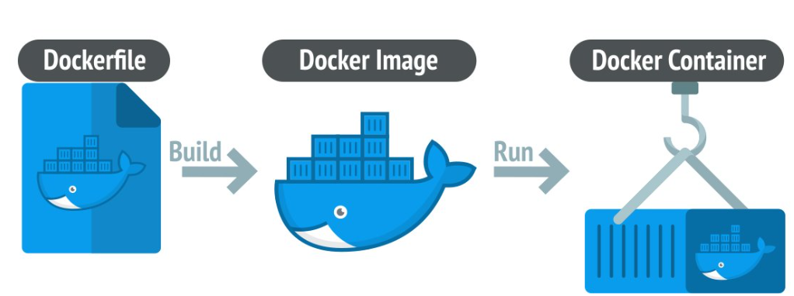

# Docker Installation Configuration
## Docker Community Edition (CE) vs Docker Enterprise Edition (EE)

Docker offers two primary versions of its platform: **Docker Community Edition (CE)** and **Docker Enterprise Edition (EE)**. Both are designed for containerized application development and deployment, but they differ in terms of features, use cases, support, and intended audience.

Here’s a breakdown of the key differences:

---

### 1. **Target Audience**

- **Docker CE**: 
  - Aimed at individual developers, hobbyists, and small teams who want to experiment with Docker and containerized applications.
  - It is suitable for development environments and non-production setups.
  
- **Docker EE**:
  - Aimed at enterprise-level organizations that require advanced features, support, and security for containerized applications in production environments.
  - It’s suited for teams, IT departments, and businesses managing critical and complex workloads.

---

### 2. **Licensing and Cost**

- **Docker CE**: 
  - **Free** and open-source.
  - It is licensed under the Apache 2.0 license.
  
- **Docker EE**: 
  - **Paid version** with a subscription-based pricing model.
  - Comes with additional features, tools, and official support from Docker.

---

### 3. **Features**

- **Docker CE**:
  - **Basic Docker Engine**: Provides essential Docker features such as container creation, management, and networking.
  - **Docker CLI/GUI**: Access to Docker's command-line interface and graphical user interface for container management.
  - **Docker Compose**: Allows the orchestration of multi-container applications.
  - **Docker Swarm**: Provides basic clustering and orchestration support for containerized applications.

- **Docker EE**:
  - **Advanced Security**: Includes features like Docker Content Trust (DCT), image signing, and vulnerability scanning (via Docker Security Scanning).
  - **Enterprise-Grade Orchestration**: Includes Docker Swarm, Kubernetes (as the default orchestrator), and tighter integration with enterprise-level monitoring and CI/CD tools.
  - **Role-Based Access Control (RBAC)**: Allows granular access control based on user roles.
  - **Integration with Active Directory (AD)** and **LDAP**: For better user authentication and access management.
  - **Certified Images**: Offers access to official Docker images that are certified by Docker and include security patches.
  - **Docker Trusted Registry**: A private container registry for managing, storing, and sharing images securely.
  - **Enterprise Support**: Access to 24/7 enterprise-grade support and SLAs from Docker.

---

### 4. **Support and Maintenance**

- **Docker CE**:
  - Community-driven support through forums, online resources, and GitHub issues.
  - No official support; it’s primarily peer-to-peer.
  
- **Docker EE**:
  - Official, **24/7 enterprise support** from Docker.
  - Access to Docker's professional services and custom SLAs (Service Level Agreements).

---

### 5. **Security**

- **Docker CE**:
  - Basic security features such as container isolation, but does not include advanced enterprise-grade security tools.
  
- **Docker EE**:
  - Enhanced security features like automated vulnerability scanning, integration with enterprise identity management systems, and image signing.
  - **Docker Content Trust** ensures that only signed images are deployed to production.
  - More rigorous security auditing and reporting mechanisms for compliance in regulated industries.

---

### 6. **Container Orchestration**

- **Docker CE**:
  - Includes basic **Docker Swarm** for container orchestration, which is suitable for smaller-scale applications and simpler use cases.
  - Does not come with Kubernetes by default.

- **Docker EE**:
  - Offers **Kubernetes** as the default orchestration engine, which is ideal for larger-scale, more complex, and production-grade containerized applications.
  - Also includes Docker Swarm as an alternative orchestration solution.

---

### 7. **Update and Versioning**

- **Docker CE**:
  - Docker CE is updated regularly, but you may need to manually manage updates and installations.
  - Stable release cycles but might not have the long-term support that enterprises require.

- **Docker EE**:
  - Offers **long-term support (LTS)** versions with guaranteed stability and security patches.
  - Docker EE customers get access to frequent updates, bug fixes, and security patches.
  - Provides a more predictable and controlled update path suited for enterprise needs.

---

### 8. **Use Cases**

- **Docker CE**:
  - Ideal for developers who are learning Docker, testing small applications, or developing non-critical applications.
  - Great for home labs, educational environments, and experimentation.
  
- **Docker EE**:
  - Ideal for businesses running production workloads that require guaranteed uptime, advanced security, and scalability.
  - Best for enterprises with mission-critical applications that require compliance, governance, and high availability.
  - Large teams and organizations needing container orchestration and monitoring at scale.

---

### Summary Comparison:

| Feature                      | **Docker CE**                            | **Docker EE**                           |
|------------------------------|------------------------------------------|-----------------------------------------|
| **Target Audience**           | Individual developers, small teams       | Enterprises, large organizations       |
| **Cost**                      | Free                                     | Paid subscription                       |
| **Licensing**                 | Apache 2.0                               | Subscription-based, commercial license |
| **Support**                   | Community-based (forums, GitHub)         | 24/7 official support                  |
| **Security Features**         | Basic security features                 | Advanced security, image signing, vulnerability scanning |
| **Orchestration**             | Docker Swarm                             | Kubernetes (default), Docker Swarm     |
| **Role-Based Access Control** | No                                       | Yes (RBAC for access management)       |
| **Certified Images**          | No                                       | Yes                                     |
| **Container Registry**        | Public registry                          | Docker Trusted Registry (private registry) |
| **Update & Maintenance**      | Regular updates (manual)                 | Long-term support (automated updates)  |
| **Compliance**                | No                                       | Yes (ideal for regulated industries)   |

---

### Conclusion:
- **Docker CE** is a great option for individuals, small teams, or hobbyists who want to experiment with Docker, build small-scale applications, or learn how containers work.
- **Docker EE** is designed for enterprise-scale production environments, offering enhanced security, support, and orchestration features suitable for large teams and mission-critical applications.

Choosing between Docker CE and Docker EE depends on the scale, security requirements, support needs, and the specific use case of your application or organization.

# How to create a Docker Containers?


To create containers in Docker, you'll follow a few key steps. Below is a general guide on how to create and manage Docker containers.


### **1. Install Docker**

Before creating containers, make sure Docker is installed on your system.

- On Linux, you can install Docker using package managers like `apt`, `yum`, or `dnf` depending on your distribution.
- On Windows or macOS, you can download the Docker Desktop installer from the official Docker website.

### **2. Pull a Docker Image**

A Docker container is based on an image. Docker images are the templates used to create containers. To create a container, you first need to pull an image from Docker Hub or use a custom image.

For example, you can pull the official **Ubuntu** image:

```bash
docker pull ubuntu
```

This will download the **Ubuntu** image to your local machine.

### **3. Create a Container from an Image**

Once you've pulled the image, you can create a container from it. Use the `docker run` command to create and run a container:

```bash
docker run -it ubuntu
```

Explanation:
- `-it` runs the container in interactive mode and attaches a terminal so you can interact with it.
- `ubuntu` is the image you pulled earlier.

After running the command, Docker will create a container based on the **Ubuntu** image and open an interactive shell within the container.

### **4. Create a Container in Detached Mode**

If you want to create a container and run it in the background (detached mode), you can use the `-d` option:

```bash
docker run -d ubuntu
```

This will start the container in the background and print the container ID.

### **5. Create a Container with Custom Configuration**

You can also pass additional options to configure your container. For example, you can set environment variables, mount volumes, or map ports.

For example, to run a web server like Nginx and map port 80 from the container to port 8080 on your host:

```bash
docker run -d -p 8080:80 nginx
```

Explanation:
- `-p 8080:80` maps port 8080 on the host machine to port 80 on the container.
- `nginx` is the image being used to create the container.

### **6. Manage Containers**

After creating a container, you can manage it with the following Docker commands:

- **List Running Containers:**

```bash
docker ps
```

- **List All Containers (including stopped ones):**

```bash
docker ps -a
```

- **Stop a Running Container:**

```bash
docker stop <container_id>
```

- **Start a Stopped Container:**

```bash
docker start <container_id>
```

- **Remove a Container:**

```bash
docker rm <container_id>
```

- **Enter a Running Container:**

```bash
docker exec -it <container_id> bash
```

This allows you to run commands inside the container.

### **7. Create a Custom Dockerfile (Optional)**

You can create a custom container image by writing a `Dockerfile`. This file contains instructions to build a Docker image.

Here’s an example of a simple Dockerfile:

```dockerfile
# Use the official Ubuntu base image
FROM ubuntu

# Set a working directory
WORKDIR /app

# Copy local files to the container
COPY . /app

# Install dependencies
RUN apt-get update && apt-get install -y curl

# Command to run when the container starts
CMD ["bash"]
```

- `FROM` specifies the base image.
- `WORKDIR` sets the working directory inside the container.
- `COPY` copies files from your local system to the container.
- `RUN` installs packages inside the container.
- `CMD` defines the default command to run when the container starts.

To build and run this custom image:

```bash
docker build -t my_ubuntu_image .
docker run -it my_ubuntu_image
```

### **8. Commit Changes to a Container (Optional)**

If you make changes to a container and want to save those changes to a new image, you can commit the changes:

```bash
docker commit <container_id> my_custom_image
```

This will create a new image (`my_custom_image`) based on the changes made in the container.

---

### Summary of Key Docker Commands:
- `docker run`: Create and run a container.
- `docker ps`: List running containers.
- `docker stop`: Stop a container.
- `docker start`: Start a container.
- `docker exec`: Run commands in a running container.
- `docker build`: Build a custom Docker image from a Dockerfile.
- `docker commit`: Save changes made in a container to a new image.

By following these steps, you can create and manage containers in Docker. If you need further clarification or have specific use cases, feel free to ask!