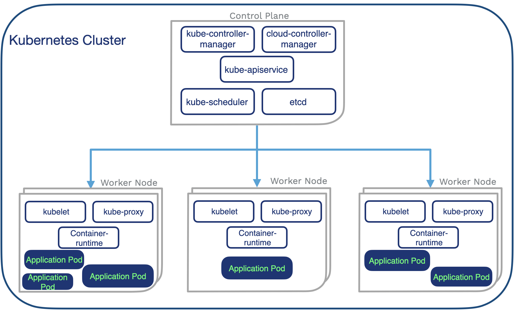

### **Kubernetes: An Overview**

**What is Kubernetes?**
Kubernetes, also known as **k8s**, is an open-source platform for automating the deployment, scaling, and management of containerized applications. It orchestrates containers to ensure that they are running efficiently, in the right places, and with the right amount of resources. 

Initially developed by **Google**, Kubernetes was open-sourced in **2014** and is now maintained by the **Cloud Native Computing Foundation (CNCF)**.

#### Key Features:
- **Automatic Load Balancing**: Ensures that no server is overwhelmed with traffic.
- **Container Management**: Manages containers (e.g., activation, suspension, and shutdown). It can also replace malfunctioning containers automatically.
- **Dynamic Scaling**: Scales applications up or down based on demand.
- **Fault Tolerance**: Kubernetes ensures applications run as expected even when a container fails.

---

### **Kubernetes Components**

Kubernetes operates through a **cluster** consisting of multiple components that work together to manage containerized applications. A **Kubernetes Cluster** consists of **Nodes** (worker machines) and **Control Plane** (manages the cluster).

---

#### **Pods**

- **Definition**: A **Pod** is the smallest deployable unit in Kubernetes. It can contain one or more containers that share the same storage and network resources.
- **Pods' Characteristics**:
  - Can run a single container or multiple containers that need to operate together.
  - Pods are **ephemeral**, meaning they have a short lifetime. If a Pod fails, Kubernetes will replace it without interrupting the workflow.
  - Pods can request resources such as **computation** and **memory** based on the workload.
- **Pod Replication**: Kubernetes can use a **DaemonSet** to replicate Pods across multiple nodes in a cluster.

---

#### **Nodes**

- **Definition**: A **Node** is a worker machine in a Kubernetes cluster. Nodes can be either **virtual** or **physical** and host the Pods.
- **Components in Nodes**:
  - **kubelet**: An agent that ensures containers are running as expected in a Node and communicates with the Control Plane.
  - **kube-proxy**: A network proxy that handles internal and external network traffic for Pods in the Node. It routes network requests to the appropriate Pod.

---

#### **Control Plane**

The **Control Plane** is responsible for managing the cluster and maintaining the desired state of applications. It controls and oversees the scheduling, monitoring, and scaling of Pods.

- **Components of the Control Plane**:
  - **kube-apiserver**: Exposes the Kubernetes API, allowing interaction with the cluster.
  - **etcd**: A distributed key-value store that stores the configuration data for the cluster.
  - **kube-scheduler**: Decides where to run Pods, based on the available resources on each Node.
  - **kube-controller-manager**: Ensures the cluster's desired state is maintained and handles lifecycle operations like scaling or updates.
  - **cloud-controller-manager**: Integrates the Kubernetes cluster with cloud service providers.

---

### **Kubernetes and Storage**

- **Ephemeral Pods**: As Pods are ephemeral, data can be lost if the Pod fails. For this reason, persistent storage is critical.
- **Persistent Volumes (PV)**: These are storage resources in Kubernetes that are not tied to the lifecycle of a Pod. When a Pod fails, the data is safe, and the new Pod can continue the task.
- **Stateful Applications**: Kubernetes provides storage solutions that are necessary for deploying stateful applications where data persistence is crucial (e.g., databases).

---

### **Key Kubernetes Concepts**

#### **DaemonSet**
- Ensures that a copy of a Pod runs on all (or some) Nodes in a cluster.
- Useful for tasks that need to be performed on every Node, such as logging or monitoring.

#### **ReplicationController / ReplicaSet**
- Ensures a specified number of identical Pods are running at any given time. This is useful for scaling and high availability.

#### **Deployment**
- A higher-level abstraction that manages the lifecycle of ReplicaSets and Pods, providing declarative updates to Pods and ReplicaSets.

#### **Services**
- Defines how Pods can be accessed either within the cluster or externally, ensuring load balancing and service discovery.

---

### **Kubernetes in Action**

- **Scaling Applications**: Kubernetes automatically adjusts the number of Pods based on traffic demand.
- **Self-Healing**: If a Pod fails, Kubernetes will automatically replace it to ensure continuous operation.
- **Networking**: Kubernetes allows communication between different Pods using **kube-proxy** for internal traffic management and **ingress controllers** for external traffic.
- **Load Balancing**: Kubernetes distributes traffic across Pods efficiently to ensure no individual container is overwhelmed with requests.

---

### **Conclusion**

Kubernetes is a powerful system for managing containerized applications at scale. It provides features like automatic scaling, load balancing, self-healing, and service discovery, all of which help to ensure applications run smoothly, even in complex environments. Understanding the components and concepts behind Kubernetes will allow you to design, deploy, and manage large-scale applications effectively.

---

### **Further Learning**
- **Kubernetes Documentation**: [Kubernetes Official Documentation](https://kubernetes.io/docs/)
