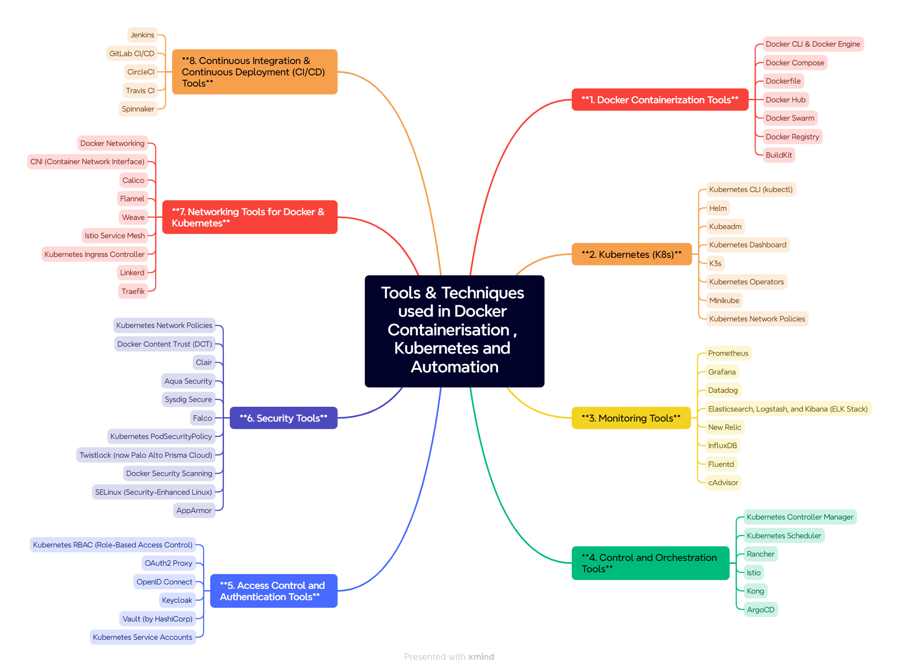

# Tools and Techniques for Docker Containerization & Kubernetes

Here’s a comprehensive list of tools and techniques for **Docker containerization**, **Kubernetes orchestration**, **monitoring**, **control**, **access**, **security**, and **networking**.

---

### **1. Docker Containerization Tools**

#### **Docker CLI & Docker Engine**
- **Docker CLI**: The command-line interface for managing Docker containers and images.
- **Docker Engine**: The runtime that manages containers, images, networks, and volumes.

#### **Docker Compose**
- Used for defining and running multi-container Docker applications. It allows you to configure services in a `docker-compose.yml` file.

#### **Dockerfile**
- A script containing instructions on how to build a Docker image.

#### **Docker Hub**
- A public repository for sharing Docker images, both official and custom-built.

#### **Docker Swarm**
- A container orchestration tool built into Docker for clustering and managing containers at scale.

#### **Docker Registry**
- A repository for storing and sharing Docker images. Private Docker registries can be used for enterprise solutions.

#### **BuildKit**
- A tool for building Docker images with better performance and advanced features (e.g., parallel builds).

---

### **2. Kubernetes (K8s)**

#### **Kubernetes CLI (kubectl)**
- The command-line tool for interacting with Kubernetes clusters. Used for deploying, scaling, and managing containerized applications.

#### **Helm**
- A package manager for Kubernetes. It simplifies the deployment of complex applications by managing Kubernetes charts (pre-configured applications).

#### **Kubeadm**
- A tool for initializing and managing Kubernetes clusters.

#### **Kubernetes Dashboard**
- A web-based user interface for managing Kubernetes clusters. It provides insight into the health and performance of your applications and nodes.

#### **K3s**
- A lightweight version of Kubernetes designed for IoT and edge computing environments.

#### **Kubernetes Operators**
- A method for packaging, deploying, and managing Kubernetes applications using custom resources.

#### **Minikube**
- A tool to run Kubernetes clusters locally. Great for development and testing.

#### **Kubernetes Network Policies**
- Used to define how pods communicate with each other and restrict access within a Kubernetes cluster.

---

### **3. Monitoring Tools**

#### **Prometheus**
- A powerful open-source monitoring and alerting toolkit designed for reliability and scalability. It is widely used with Kubernetes for monitoring containerized applications.

#### **Grafana**
- A visualization tool that integrates with Prometheus and other data sources to provide graphical representations of application metrics.

#### **Datadog**
- A monitoring and analytics platform for cloud-scale applications. It provides visibility into the performance of containers, Kubernetes clusters, and other infrastructure.

#### **Elasticsearch, Logstash, and Kibana (ELK Stack)**
- A set of tools for logging, monitoring, and visualizing data. Logstash aggregates logs, Elasticsearch stores and indexes logs, and Kibana provides visualizations.

#### **New Relic**
- A software analytics and performance monitoring tool that helps you monitor application performance, including Dockerized apps and Kubernetes clusters.

#### **InfluxDB**
- A time-series database used to monitor metrics and events in containerized applications.

#### **Fluentd**
- A log collector used to gather logs from various sources, which can then be forwarded to other systems like Elasticsearch or a central log manager.

#### **cAdvisor**
- A monitoring tool developed by Google to collect, aggregate, process, and export information about running containers.

---

### **4. Control and Orchestration Tools**

#### **Kubernetes Controller Manager**
- A set of controllers that run in the Kubernetes control plane and ensure the desired state of the cluster matches the actual state (e.g., replication controllers, deployment controllers).

#### **Kubernetes Scheduler**
- The component responsible for scheduling pods to nodes in the cluster based on resource availability and constraints.

#### **Rancher**
- A container management platform that helps you deploy and manage Kubernetes clusters. Rancher also simplifies multi-cluster management.

#### **Istio**
- An open-source service mesh that provides features like traffic management, security, and observability for microservices applications running on Kubernetes.

#### **Kong**
- An API Gateway and microservices management layer for controlling the communication between services.

#### **ArgoCD**
- A declarative, GitOps continuous delivery tool for Kubernetes that automates application deployment and management.

---

### **5. Access Control and Authentication Tools**

#### **Kubernetes RBAC (Role-Based Access Control)**
- A method for regulating access to Kubernetes resources. Users are assigned roles with specific permissions to manage Kubernetes resources.

#### **OAuth2 Proxy**
- A reverse proxy that authenticates users with OAuth 2.0 and integrates with services like Google, GitHub, etc.

#### **OpenID Connect**
- A protocol built on top of OAuth 2.0 for user authentication in Kubernetes clusters.

#### **Keycloak**
- An open-source identity and access management solution that provides features like authentication and Single Sign-On (SSO).

#### **Vault (by HashiCorp)**
- A tool for managing secrets and protecting sensitive data (e.g., database credentials, API keys) in your infrastructure.

#### **Kubernetes Service Accounts**
- A way to manage API access to Kubernetes resources by assigning a service account to a pod for authorization.

---

### **6. Security Tools**

#### **Kubernetes Network Policies**
- A set of rules that control the traffic flow between pods. They can restrict which services or pods can communicate with each other.

#### **Docker Content Trust (DCT)**
- A security feature in Docker that uses digital signatures to verify the authenticity and integrity of images.

#### **Clair**
- An open-source project for the static analysis of vulnerabilities in container images. It is used to scan Docker images for security flaws.

#### **Aqua Security**
- A container security platform that helps secure Docker containers, Kubernetes, and serverless environments. It provides image scanning, runtime protection, and more.

#### **Sysdig Secure**
- A cloud-native security solution that focuses on container and Kubernetes security. It provides threat detection, compliance monitoring, and runtime protection.

#### **Falco**
- A behavioral activity monitoring tool that detects anomalous behavior in containers and Kubernetes environments.

#### **Kubernetes PodSecurityPolicy**
- A Kubernetes security resource that defines the conditions under which a pod may be deployed, specifying security contexts, permissions, and limits.

#### **Twistlock (now Palo Alto Prisma Cloud)**
- A comprehensive container security tool that focuses on vulnerability management, compliance, and runtime protection.

#### **Docker Security Scanning**
- A feature within Docker Enterprise for scanning images to identify vulnerabilities in the container and its dependencies.

#### **SELinux (Security-Enhanced Linux)**
- A security module for Linux that provides access control policies, often used in containerized environments to enforce security boundaries.

#### **AppArmor**
- A Linux security module that is used to restrict programs’ capabilities with security profiles, providing an extra layer of protection for containers.

---

### **7. Networking Tools for Docker & Kubernetes**

#### **Docker Networking**
- **Bridge Network**: The default network used for Docker containers.
- **Host Network**: A network mode that connects the container to the host’s network.
- **Overlay Network**: Used for networking between Docker Swarm nodes.
- **Macvlan Network**: Allows containers to have their own IP addresses.

#### **Kubernetes Networking**
- **CNI (Container Network Interface)**: A specification and libraries for container networking.
- **Calico**: A popular CNI plugin for Kubernetes that provides networking and network policy enforcement.
- **Flannel**: A simple CNI plugin for Kubernetes that provides networking between containers.
- **Weave**: A CNI plugin used to create a network across Kubernetes pods.
- **Istio Service Mesh**: Provides networking features like load balancing, traffic routing, and security for microservices deployed in Kubernetes.

#### **Kubernetes Ingress Controller**
- Manages external access to services within a Kubernetes cluster, typically HTTP/HTTPS traffic.

#### **Linkerd**
- A lightweight service mesh for Kubernetes that provides microservices networking capabilities such as traffic management, load balancing, and observability.

#### **Traefik**
- A modern reverse proxy and load balancer that integrates well with Docker and Kubernetes environments.

---

### **8. Continuous Integration & Continuous Deployment (CI/CD) Tools**

#### **Jenkins**
- An open-source automation server used for automating the building, testing, and deploying of Docker and Kubernetes applications.

#### **GitLab CI/CD**
- A fully integrated CI/CD solution that supports Docker and Kubernetes deployments.

#### **CircleCI**
- A cloud-based CI/CD tool that integrates well with Docker for containerized applications.

#### **Travis CI**
- Another cloud-based CI/CD tool that can automate deployments to Kubernetes clusters.

#### **Spinnaker**
- An open-source, multi-cloud continuous delivery platform designed to support Kubernetes and Docker container deployments.

---

### **Summary**

This list covers a broad range of tools and techniques used in **Docker containerization**, **Kubernetes orchestration**, **monitoring**, **control**, **access**, **security**, and **networking**. These tools help in managing, scaling, securing, and networking containerized applications across both development and production environments.

- **Containerization Tools**: Docker, Docker Compose, Docker Swarm
- **Kubernetes Tools**: Helm, kubectl, K3s, Rancher, Minikube
- **Monitoring**: Prometheus, Grafana, Datadog, ELK Stack
- **Security**: Aqua Security, Twistlock, Falco, Vault
- **Networking**: Istio, Calico, Flannel, Traefik, CNI plugins
- **CI/CD**: Jenkins, GitLab, CircleCI, Spinnaker

By using the right combination of these tools, organizations can ensure their applications are secure, scalable, and well-monitored in containerized environments.