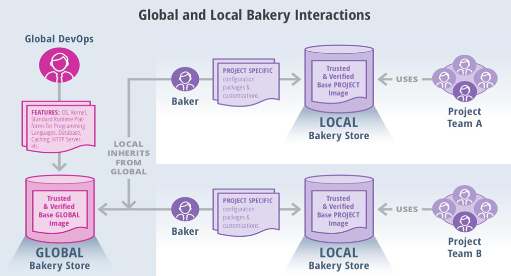

# Bakery Interaction

This image titled **"Global and Local Bakery Interactions"** illustrates how **container image creation and customization** is managed in a **multi-layered DevOps environment** using a bakery model. It highlights **inheritance**, **customization**, and **reuse** of trusted base images to support **multiple local project teams**.

Let’s break it down:

---

## 🔹 1. **Global Bakery Store & Global DevOps Team**
- **Role**: The **Global DevOps team** is responsible for building a **Trusted & Verified Base GLOBAL Image**.
- **Contents/Features** (shown in the pink box):
  - Operating System (OS)
  - Kernel
  - Standard Runtime Platforms for:
    - Programming Languages (e.g., Python, Java, Node.js)
    - Databases
    - Caching systems (e.g., Redis)
    - Web/HTTP servers (e.g., NGINX, Apache)
- **Purpose**: These foundational components are standardized, hardened for security, and verified.

✅ **Output**: The image is stored in the **Global Bakery Store** for downstream use.

---

## 🔸 2. **Local Inheritance from Global**
- **Process**:
  - Local environments **inherit** the global base image.
  - This ensures **consistency** and **security** across all projects, regardless of local modifications.
- **Why It’s Important**:
  - Avoids duplication of effort.
  - Ensures all projects start from a common, secure baseline.

---

## 🟣 3. **Baker (Local DevOps Engineer)**
- **Who They Are**: DevOps engineers or image maintainers responsible for tailoring the global image to fit local needs.
- **What They Do**:
  - Apply **project-specific** configuration, packages, and customizations (e.g., app dependencies, monitoring tools).
- **Tools Used**: Likely use Dockerfiles, automation scripts, and CI/CD pipelines to perform this customization.

---

## 🔸 4. **Trusted & Verified Base Project Image**
- **What It Is**: The result of applying local customizations to the inherited global image.
- **Stored In**: The **Local Bakery Store**.
- **Trust Layer**:
  - Even though customizations are added, the image is **verified and trusted locally**, often with added internal policies.

---

## 🔹 5. **Project Teams (Team A, Team B, etc.)**
- **Who They Are**: Application developers, QA engineers, or other contributors working on specific projects.
- **What They Use**: The **Trusted & Verified Base Project Image** to build and run their applications.
- **Benefits**:
  - No need to worry about OS/runtime/security layers.
  - They inherit all improvements from both global and local levels.

---

## 🧩 Key Concepts:
| Concept | Description |
|--------|-------------|
| **Inheritance** | Local images are built **on top of** global base images. |
| **Customization** | Local teams can add project-specific tools and configurations. |
| **Trust & Verification** | Both global and local images go through a trust validation process. |
| **Reuse** | Multiple teams can reuse locally customized base images. |

---

### 📝 Summary:
This model showcases a **modular, scalable, and secure approach** to managing container images across multiple teams:
- **Global Team** standardizes the base.
- **Local Teams** customize per project.
- **Project Teams** deploy with speed and confidence using trusted images.

