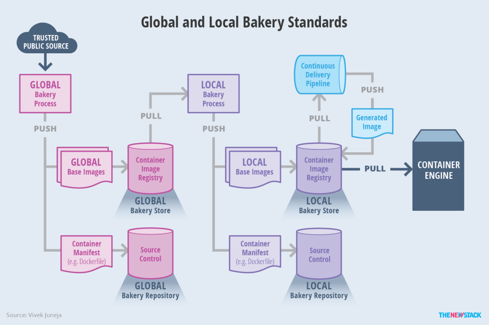

Here’s a detailed write-up covering all the topics from Unit No. 4: **Docker & Containers**, incorporating concepts from the provided links.

---

# **Unit No. 4: Docker & Containers**

## **1. Bakery as a Foundation**
The concept of the **"Bakery"** in DevOps refers to a standardized and automated approach for building, packaging, and distributing immutable infrastructure images. This process ensures that every deployment uses a consistent and pre-configured environment, eliminating issues related to configuration drift and dependency mismatches.

Netflix pioneered this approach with their **"Aminator"** tool, which automates the creation of Amazon Machine Images (AMIs) using pre-defined templates. The idea has since expanded into **containerized environments**, where tools like **Docker BuildKit** and **Packer** serve similar purposes for baking images in modern cloud-native applications.

**Key Benefits of the Bakery Approach:**
- **Consistency:** Ensures that all instances or containers use the same configuration.
- **Security:** Reduces the risk of misconfigurations by enforcing strict build processes.
- **Efficiency:** Eliminates the need for runtime configuration, improving deployment speed.

---

## **2. Defining the Model of a Bakery**

A **Bakery Model** defines how images are created, stored, and deployed. This model consists of the following key components:

- **Ingredients:** The base operating system, application dependencies, configurations, and security policies.
- **Recipe:** The set of scripts and automation steps defining how to assemble the image.
- **Oven:** The image-building pipeline, which can be a tool like **HashiCorp Packer, Docker BuildKit, or Netflix Aminator**.
- **Final Product:** The baked image, which is versioned and stored in a registry for deployment.

Netflix’s Aminator follows this model to automate **Amazon Machine Image (AMI) creation**, ensuring that each baked image is identical and free from configuration drift.

---

## **3. Bakery Standards**
To ensure that baked images adhere to best practices, a set of **Bakery Standards** is followed:

- **Use of Minimal Base Images:** Reducing unnecessary dependencies lowers security risks (e.g., Alpine Linux instead of Ubuntu).
- **Immutable Infrastructure:** Images should never be modified after deployment; updates should be handled via a new image.
- **Automated Security Checks:** Scanning tools like **Trivy, Clair, and AWS Inspector** ensure compliance with security standards.
- **Version Control:** Every baked image should be tagged and stored in a **container registry** (e.g., Docker Hub, AWS ECR, Google Container Registry).

---

## **4. Bakery Interactions**
The Bakery model interacts with various DevOps and cloud-native tools to ensure seamless deployments:

1. **CI/CD Pipeline Integration:**
   - Developers push code changes to a **Git repository**.
   - A build pipeline triggers the **image baking process**.
   - The new image is stored in a **container registry**.
   - The latest version is deployed using **Kubernetes, Docker Swarm, or Terraform**.

2. **Integration with Security & Compliance:**
   - **Runtime security scanning** using Falco or Aqua Security.
   - **Secrets management** using Vault or AWS Secrets Manager.

---

## **5. Bakery Model Practices: Discovery & Implementation**
### **Best Practices**
- **Infrastructure as Code (IaC):** Use **Terraform or CloudFormation** to define image-building processes.
- **Automated Testing:** Implement unit tests for baked images to ensure functionality.
- **Rollback Strategies:** Use versioning to roll back to a previous image in case of failure.

### **Implementation Example**
Netflix’s **Aminator** automates AMI creation, ensuring that AWS instances are built with secure, standardized configurations.

---

## **6. Global Bakery Through Automation**
To scale a **Bakery Model** globally, organizations implement **CI/CD automation** and **multi-region deployments**.

- **Multi-Cloud Image Distribution:** Distribute images across multiple regions using **AWS CloudFront, Akamai, or Google Cloud CDN**.
- **Cross-Region Replication:** Store images in multiple container registries to reduce latency and increase availability.

---

## **7. Cluster Applications in a Public Cloud for Kubernetes**
Organizations use **managed Kubernetes services** to run containerized workloads in the public cloud:

- **AWS EKS:** Fully managed Kubernetes service with deep AWS integration.
- **Azure AKS:** Microsoft’s managed Kubernetes service optimized for Azure.
- **Google GKE:** Google's auto-managed Kubernetes cluster service.

### **Use Cases**
- **Microservices Deployment:** Running containerized applications with auto-scaling.
- **Big Data Processing:** Running Apache Spark and Kafka workloads on Kubernetes.
- **Machine Learning Workloads:** Deploying TensorFlow and PyTorch models.

---

## **8. Private Cloud - Exposing Services via External Load Balancers**
In **private cloud environments**, services must be exposed securely via **load balancers**:

- **Layer 4 Load Balancers (TCP/UDP):** AWS NLB, HAProxy.
- **Layer 7 Load Balancers (HTTP/S):** NGINX, AWS ALB, Traefik.

Example: Using an **NGINX reverse proxy** to route internal services.

---

## **9. Private Cloud - Exposing Services via Ingress**
**Ingress controllers** allow Kubernetes services to be exposed externally without requiring a dedicated **load balancer** for each service:

- **NGINX Ingress Controller:** A popular option for managing traffic within Kubernetes clusters.
- **Traefik Ingress:** Provides automated service discovery and routing.

---

## **10. Health Check & Repair Activity**
### **Kubernetes Health Checks**
- **Liveness Probe:** Detects if a container has crashed and restarts it.
- **Readiness Probe:** Ensures traffic is only sent to healthy containers.

### **Automated Repair Strategies**
- **Self-Healing Mechanisms:** Kubernetes automatically replaces failed pods.
- **Rolling Updates & Rollbacks:** Ensures zero-downtime deployments.

---

## **11. Kubernetes No-Redundancy Redundancy Model**
In a **no-redundancy model**, failures lead to downtime. This is acceptable for:
- Development and testing environments.
- Cost-sensitive applications.

---

## **12. Kubernetes N-Way Active Redundancy Model**
In an **N-way redundancy model**, multiple active instances ensure high availability.

Example: **Netflix deploys microservices across multiple AWS availability zones**.

---

## **13. Experiments with Kubernetes**
Organizations experiment with Kubernetes to enhance resilience and scalability:

- **Chaos Engineering:** Netflix’s **Chaos Monkey** tests failure scenarios.
- **Service Mesh Experiments:** Comparing **Istio vs. Linkerd** for service traffic management.

---

## **14. Comparing Kubernetes & OpenSAF**
- **Kubernetes:** Best for cloud-native applications.
- **OpenSAF:** A fault-tolerant framework used in **telecom and embedded systems**.

---

## **15. Top Orchestration Products**
- **Kubernetes:** Enterprise-grade orchestration.
- **Docker Swarm:** Simpler, lightweight container orchestration.
- **Apache Mesos:** Supports **multiple workloads**, including Spark and Kubernetes.

---

## **16. Configuration Management & Orchestration**
Tools like **Ansible, Puppet, and Chef** automate infrastructure provisioning.

Use case: **Ansible playbooks** to automate Kubernetes deployments.

---

## **17. Styles of Workload Orchestration**
- **Declarative:** Kubernetes, Terraform (define the desired state).
- **Imperative:** Manual scripting (Docker CLI, Bash).

---

## **18. Container Orchestration – Herding Computational Cattle**
- **Pets vs. Cattle Analogy:**
  - **Pets:** Traditional VMs (manually managed).
  - **Cattle:** Containers (automatically deployed and scaled).

---

## **19. Emerging Containers-as-a-Service (CaaS) Marketplace**
- **AWS Fargate:** Serverless container execution.
- **Azure Container Instances:** On-demand containerization.
- **Google Cloud Run:** Knative-powered CaaS.

---

## **Conclusion**
- **The Bakery Model** standardizes container image creation.
- **Kubernetes** dominates the orchestration space.
- **CaaS platforms** simplify container management.

This detailed document should serve as a foundational reference on **Docker & Containers**. Let me know if you need further modifications! 🚀