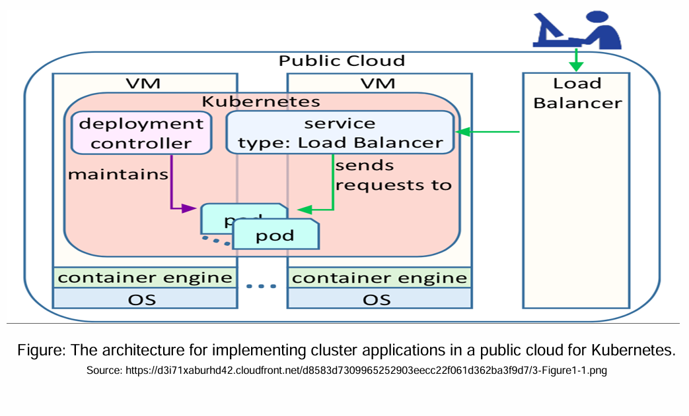

# 🧭 Title: **Kubernetes Cluster Architecture in AWS Public Cloud**



### 🎯 Objective:
This diagram shows how **Kubernetes orchestrates containers inside a public cloud (AWS in this case)** to ensure scalability, availability, and maintainability of containerized applications. It focuses on how **pods are deployed, maintained, and exposed** to users using a **load balancer service**.

---

## 📌 1. **Public Cloud – AWS as the Hosting Platform**

In this architecture:
- The **Public Cloud** is represented by **AWS (Amazon Web Services)**.
- AWS provides the **virtual infrastructure** (VMs, Load Balancer, networking, etc.) to host and scale Kubernetes clusters.

### Relevant AWS Services:
- **EC2 (Elastic Compute Cloud):** For running Kubernetes nodes (VMs).
- **EKS (Elastic Kubernetes Service):** AWS’s managed Kubernetes platform.
- **Elastic Load Balancer (ELB):** For traffic distribution (used with `Service Type: LoadBalancer`).
- **EBS or EFS:** For storage volumes mounted into pods.

---

## 🧱 2. **Virtual Machines (VMs)**

These are **EC2 instances**:
- They run the **Kubernetes worker nodes** and master/control plane (in a non-managed setup).
- In AWS EKS, the **control plane is managed by AWS**, and you manage only the **worker nodes (EC2)**.
- Each VM includes:
  - **Operating System (OS)** – typically Linux (Amazon Linux 2, Ubuntu).
  - **Container Engine** – like Docker or containerd to run containers.

---

## 🐳 3. **Container Engine**

- This is the **runtime** that executes your containers inside the pods.
- Examples: `Docker`, `containerd` (default in Kubernetes now).
- The engine:
  - Pulls container images.
  - Runs containers.
  - Manages the lifecycle of containers inside each pod.

---

## 🛠️ 4. **Kubernetes Control Components**

### a. **Deployment Controller**
- Automates the **management of pod replicas**.
- It **ensures the desired state** (e.g., 3 replicas of an app) is maintained:
  - If a pod crashes, the controller creates a new one.
  - If scaling is required, it increases or decreases pods.
- Defined via a **Deployment YAML** in Kubernetes.

### b. **Pods**
- The **smallest deployable unit** in Kubernetes.
- A **pod can host one or more containers** that share:
  - Networking (IP, ports),
  - Storage volumes,
  - Configuration.
- These are ephemeral – managed and recreated automatically.

---

## 🌐 5. **Service (Type: LoadBalancer)**

- In Kubernetes, a **Service** is an abstraction that exposes a set of pods as a network service.
- `type: LoadBalancer` automatically provisions an **AWS ELB** (Elastic Load Balancer).
- This service:
  - Accepts external HTTP/S or TCP traffic.
  - Routes it to the appropriate pod(s) based on labels.

### AWS-Specific Behavior:
- When `type: LoadBalancer` is used:
  - Kubernetes calls AWS APIs.
  - **Creates a Network Load Balancer (NLB)** or **Classic Load Balancer (CLB)**.
  - ELB is linked to Kubernetes nodes where your pods are scheduled.

---

## 🔄 6. **Request Flow (User to Pod)**

1. A user sends a request to the application (e.g., via browser or API client).
2. The request hits the **AWS ELB**.
3. ELB forwards it to the **Kubernetes Service (LoadBalancer type)**.
4. The service then routes the request to one of the healthy **pods** running in the cluster.
5. If a pod dies or is unreachable:
   - The **Deployment Controller** spins up a new pod automatically.
   - Traffic is re-routed to healthy pods.

---

## 📦 Example in Real Life

Let's say you deploy a Node.js app:

1. You define a **Deployment** that requests 3 replicas of the app pod.
2. A **Service** is created using `type: LoadBalancer`.
3. Kubernetes creates 3 pods on EC2 nodes.
4. AWS creates an ELB and assigns it a public IP.
5. The ELB distributes user traffic across the 3 pods.

---

## 🔐 Additional Considerations in AWS

| Component | AWS Service Used | Purpose |
|----------|------------------|---------|
| Nodes (VMs) | EC2 | Host Kubernetes worker nodes |
| Container Engine | Docker/containerd | Run containerized apps |
| Networking | VPC, ENI, Security Groups | Pod communication & external access |
| Load Balancing | ELB (NLB/CLB/ALB) | Expose services externally |
| Storage | EBS/EFS | Persistent volume for pods |
| IAM | Identity & Access Management | Secure access to AWS APIs |

---

## ✅ Summary

This architecture:
- Combines Kubernetes orchestration with AWS infrastructure.
- Offers **automated scaling, fault-tolerance, and service discovery**.
- Enables **external access via AWS-managed Load Balancer**.
- Supports **dynamic updates and resilient infrastructure** for microservices and containerized apps.

---

Here’s a complete example of Kubernetes YAML files for deploying a **Python-based web application** (like a Flask app) on **AWS EKS**, along with a **LoadBalancer service** that exposes it to the internet via an **AWS Elastic Load Balancer (ELB)**.

---

### 🐍 **Python Flask App Dockerfile (for reference)**
If you haven't built the container yet:

```dockerfile
# Dockerfile
FROM python:3.9-slim

WORKDIR /app

COPY requirements.txt requirements.txt
RUN pip install -r requirements.txt

COPY . .

CMD ["python", "app.py"]
```

`requirements.txt` should include Flask:
```
Flask==2.2.2
```

`app.py` (example):
```python
from flask import Flask
app = Flask(__name__)

@app.route("/")
def hello():
    return "Hello from Python on Kubernetes!"

if __name__ == "__main__":
    app.run(host="0.0.0.0", port=5000)
```

---

## 🧾 Kubernetes YAML: Deployment + LoadBalancer Service

```yaml
# python-app-deployment.yaml

apiVersion: apps/v1
kind: Deployment
metadata:
  name: python-app
  labels:
    app: python-app
spec:
  replicas: 3
  selector:
    matchLabels:
      app: python-app
  template:
    metadata:
      labels:
        app: python-app
    spec:
      containers:
        - name: python-app
          image: <your-dockerhub-username>/python-k8s-app:latest  # Update with your image
          ports:
            - containerPort: 5000
```

---

```yaml
# python-app-service.yaml

apiVersion: v1
kind: Service
metadata:
  name: python-app-service
spec:
  selector:
    app: python-app
  type: LoadBalancer  # Creates AWS ELB
  ports:
    - protocol: TCP
      port: 80        # Port exposed to the outside world
      targetPort: 5000  # Container port
```

---

## 🧪 Steps to Deploy in AWS EKS

1. **Push your Docker image** to Docker Hub or Amazon ECR:
   ```bash
   docker build -t <your-username>/python-k8s-app .
   docker push <your-username>/python-k8s-app
   ```

2. **Deploy to Kubernetes**:
   ```bash
   kubectl apply -f python-app-deployment.yaml
   kubectl apply -f python-app-service.yaml
   ```

3. **Get the External IP (AWS ELB)**:
   ```bash
   kubectl get svc python-app-service
   ```

   You'll see an `EXTERNAL-IP` field populated after a minute. That’s your AWS Load Balancer endpoint.

---
