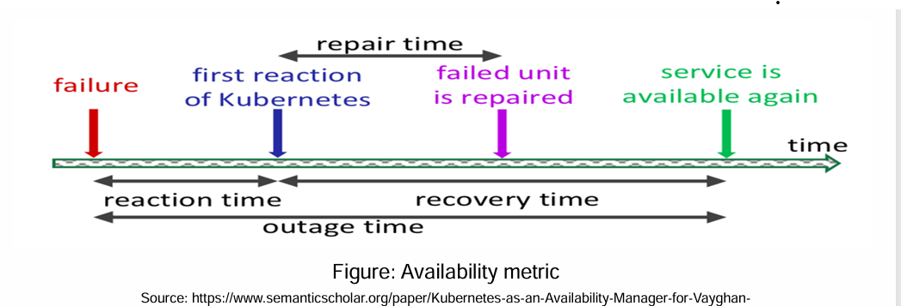

# Health check and repair activity
---

## 📊 Recreated Table: **Kubernetes Failure Recovery Times (No Redundancy Setup)**

| **Failure Trigger**       | **Reaction Time (s)** | **Repair Time (s)** | **Recovery Time (s)** | **Outage Time (s)** |
|--------------------------|------------------------|----------------------|------------------------|----------------------|
| VLC Container Failure     | 0.716                  | 0.472                | 1.050                  | 1.766                |
| Pod Container Failure     | 0.496                  | 32.570               | 31.523                 | 32.019               |
| Node Failure              | 38.187                 | 262.542              | 262.665                | 300.852              |

---

## 🖼 Recreated Diagram: **Kubernetes Repair Timeline**



```
🔍 Detailed Explanation of Terms
📌 1. Reaction Time
Definition: Time between the failure event and Kubernetes detecting the failure.

What Happens:

Kubernetes health probes or kubelet notices that a container or node has stopped responding.

This delay depends on the frequency of liveness/readiness probes or heartbeat checks.

📌 2. Repair Time
Definition: Time taken to initiate and complete the repair (e.g., restarting pod, rescheduling on another node).

What Happens:

For container failures: A restart is triggered by the kubelet or deployment controller.

For node failures: Pods need to be evicted and rescheduled on healthy nodes.

📌 3. Recovery Time
Definition: Time between Kubernetes detecting the failure and the service becoming fully operational again.

What Happens:

Includes container image pulling, starting the app, warm-up time.

Longer for stateful apps or heavy containers.

📌 4. Outage Time
Formula: Reaction Time + Recovery Time

What It Means:

This is the total duration for which the service was unavailable to end-users.

🧪 Key Insights from the Table

Failure Type	Observations
VLC Container Failure	Quickest recovery. Total downtime: 1.76s. Reaction and repair are fast due to local container handling.
Pod Container Failure	Longer downtime due to 30+ seconds of repair and recovery. Likely involves rescheduling and image pulling.
Node Failure	Very long downtime (~5 minutes). Kubernetes takes time to declare a node unhealthy and then reallocate workloads.
💡 Practical Implications
🔧 Proactive Health Checks: Use aggressive liveness/readiness probes for faster detection.

🏃 Autoscaling and Redundancy: Enable Horizontal Pod Autoscaling (HPA) and Pod Disruption Budgets (PDBs) to reduce recovery time.

🚀 Node Monitoring: Use NodeProblemDetector or external monitoring for faster reaction to node failures.

📦 Lightweight Containers: Smaller containers start faster, improving recovery time.

