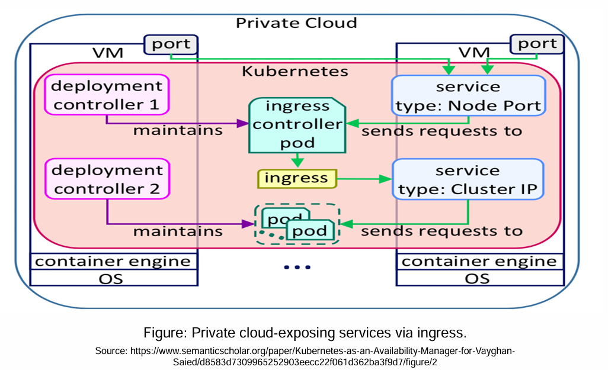

# Private cloud-exposing services via Ingress
---



### 🌐 **Overview: What’s Happening?**
This diagram illustrates how **services within a Kubernetes cluster in a private cloud** can be exposed to users using **Ingress**, which acts as a smart traffic router. Unlike public cloud setups where services are exposed via **LoadBalancer**, in a private setup, services are exposed through **Ingress + NodePort**.

---

## 📦 Components in the Diagram:

### 1. **Private Cloud**
- Represents the isolated cloud infrastructure (e.g., hosted on-premises or in a private datacenter).
- The cluster and all components are hosted here and are not inherently exposed to the public internet.

---

### 2. **VM (Virtual Machine)**
- Each VM runs:
  - **Operating System (OS)**
  - **Container engine** (like Docker or containerd)
  - Kubernetes components like kubelet, and pods
- These VMs together make up the Kubernetes worker nodes.

---

### 3. **Deployment Controller 1 & 2**
- These are Kubernetes **Deployments** (or ReplicaSets) that:
  - Ensure a specified number of **pods** are always running
  - Handle self-healing (restarting pods if they fail)

---

### 4. **Pods**
- These are the **smallest deployable units in Kubernetes**, each running one or more containers.
- They run the actual business logic or application services (like a Python/Django or Flask app).

---

### 5. **Service Types**
Kubernetes uses **Services** to expose pods to other pods or to external clients. In this architecture:

#### a. **ClusterIP Service**
- **Default service type**
- Only accessible **within the cluster**
- Routes traffic to appropriate pods based on labels

#### b. **NodePort Service**
- Exposes the service on **each node's IP at a static port**
- Makes the service accessible **externally** through the VM's IP and port (via firewall/NAT)
- Used here to expose the **Ingress Controller Pod**

---

### 6. **Ingress Controller Pod**
- This is a pod running a reverse proxy/load balancer like **NGINX, Traefik**, or **HAProxy**.
- Handles **incoming external HTTP/HTTPS requests**
- Watches for **Ingress resources** in the cluster and dynamically configures routing rules.

---

### 7. **Ingress Resource**
- A Kubernetes object that **defines rules for routing** external HTTP/S traffic to internal services.
- Example:
```yaml
apiVersion: networking.k8s.io/v1
kind: Ingress
metadata:
  name: my-app-ingress
spec:
  rules:
  - host: myapp.local
    http:
      paths:
      - path: /
        pathType: Prefix
        backend:
          service:
            name: my-app-service
            port:
              number: 80
```

---

### 8. **Traffic Flow (Step-by-Step)**

1. 🔓 **External User Accesses Application**
   - They access `http://myapp.local` (through port exposed via NodePort on the VM)

2. 🌐 **Request Hits NodePort**
   - The request is routed to the **Ingress Controller Pod** using NodePort service

3. 🚦 **Ingress Controller Handles Routing**
   - The controller reads Ingress rules
   - Determines which service to forward the request to

4. 📡 **Routes to ClusterIP Service**
   - The request is forwarded to an internal **ClusterIP** service

5. 📥 **ClusterIP Service Sends to Pods**
   - Finally, traffic is load-balanced and sent to the appropriate backend pods

---

### 🔒 Why Use Ingress in Private Cloud?

- Reduces the number of exposed NodePorts or LoadBalancer services
- Centralizes routing and SSL termination
- More secure and efficient for **multi-tenant** or microservices architectures

---

## ✅ Use Case: Private Cloud with Internal Networking

Let’s say you’re running a banking application in your own datacenter. You want to expose:
- `/app1` to backend service1
- `/app2` to backend service2

Using **Ingress**, you can configure routing via a single endpoint (NodePort) instead of exposing each service individually. It looks cleaner, uses fewer resources, and simplifies SSL setup.

---

